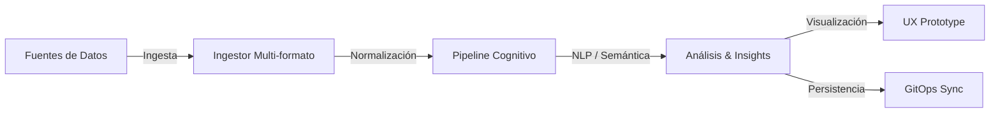
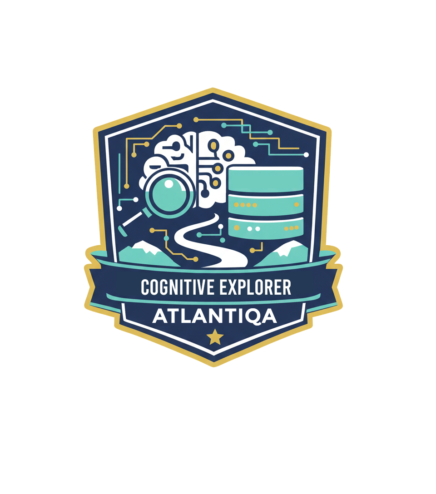
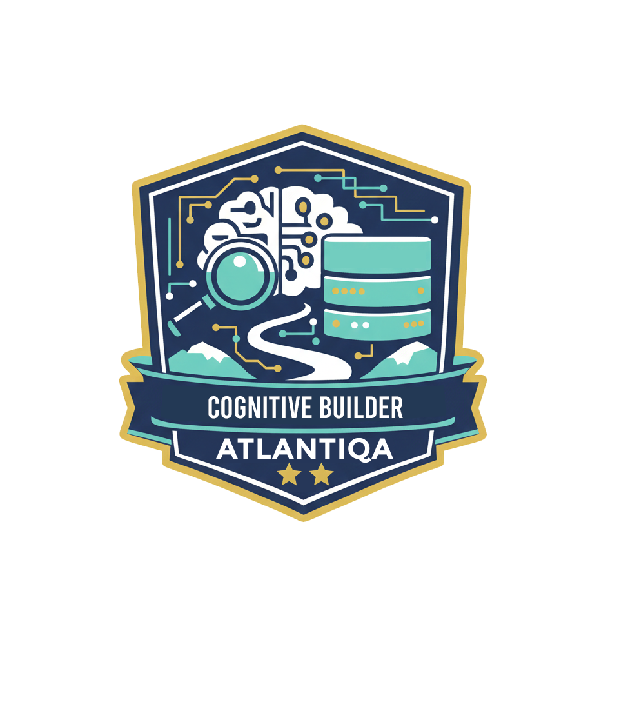
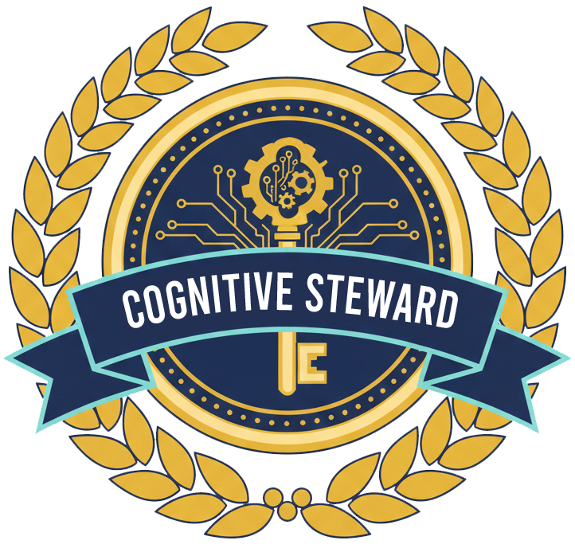

<p align="center">
  
</p>

<p align="center">
  <strong>Soberanía Digital · Capital Cognitivo · Local-First Enclave</strong>
</p>

<p align="center">
  <a href="https://github.com/atlantyqa-labs/cognitive-suite/actions"></a>
  <a href="LICENSE"></a>
  
  
</p>

---

## 🧠 Atlantyqa Cognitive Suite

> **No venimos solo a construir software. Entrenamos criterio humano para cooperar con sistemas inteligentes.**

**Atlantyqa Cognitive Suite** es un ecosistema *local-first* diseñado para la ingesta, análisis semántico y gobernanza de capital cognitivo. Este proyecto permite a individuos y cooperativas gestionar sus datos de forma soberana, reproducible y auditable, alineándose con los estándares de privacidad y soberanía digital europea.

### 🌟 Pilares del Proyecto

- **Soberanía Digital**: Ejecución local (Enclave) sin dependencia de nubes externas para el procesamiento crítico.
- **Aprendizaje Gamificado**: Ruta de aprendizaje basada en la práctica ("Learning by Doing").
- **Ecosistema Cooperativo**: Diseñado para el capital compartido en comunidades técnicas y sociales.

---

## 🔁 Flujo de Inteligencia

La suite automatiza el ciclo de vida del dato desde su origen hasta su visualización y persistencia segura:



---

## ⚡ Quick Start

### A. Demo Local (Docker)
Ideal para una primera exploración sin configurar el entorno de desarrollo.

```bash
# 1. Login en el registro (requiere PAT si es privado)
docker login ghcr.io

# 2. Desplegar servicios demo
docker compose -f docker-compose.local-demo.yml up -d
```
> [!TIP]
> Accede a la interfaz en `http://localhost:8501` tras el despliegue.

### B. Modo Desarrollador (Python CLI)
Para aquellos que quieren entrar directo al código y personalizar el pipeline.

```bash
# Sincroniza y prepara el entorno
python cogctl.py init

# Ingesta y análisis
python cogctl.py ingest data/input/mi_archivo.pdf
python cogctl.py analyze
```

---

## 🎮 Ruta de Aprendizaje (Gamified)

Cada contribución es un paso en tu evolución como profesional de la Era Cognitiva.

| Nivel | Rol | Badge | Reto Sugerido |
| :---: | :--- | :---: | :--- |
| **1** | **Cognitive Explorer** |  | Ejecuta el flujo `init → ingest → analyze` y valida los resultados. |
| **2** | **Cognitive Builder** |  | Ajusta pesos o categorías en el pipeline de análisis semántico. |
| **3** | **Cognitive Engineer** |  | Desarrolla un nuevo conector de ingesta o mejora los tests de CI. |
| **4** | **Cognitive Steward** |  | Lidera la gobernanza de datos y mentoriza a nuevos compañeros. |

---

## � Arquitectura

| Directorio | Propósito |
| :--- | :--- |
| `docs/` | Documentación técnica y estratégica (MkDocs). |
| `ingestor/` | Extracción de contenido (PDF, DOCX, Audio, Vídeo). |
| `pipeline/` | Motor de análisis cognitivo (spaCy + Transformers). |
| `frontend/` | UI interactiva basada en Streamlit. |
| `gitops/` | Automatización de flujos de sincronización. |
| `schemas/` | Definición de contratos de datos (JSON Schema). |

---

## 📚 Documentación Expandida

La suite cuenta con un portal de documentación completo generado con MkDocs Material:

- 📖 **Portal de Docs**: `https://atlantyqa-labs.github.io/cognitive-suite/`
- 🛠️ [Guía de Instalación](docs/installation.md)
- 🧭 [Visión de Usuario](docs/user-vision.md)
- 🤝 [Cómo Contribuir](CONTRIBUTING.md)

---

## ⚖️ Licencia y Modelo

Este proyecto es software libre bajo la licencia **EUPL-1.2**.
Desarrollado dentro del ecosistema **ATLANTYQA** como infraestructura de capital cognitivo compartido.

> *"El futuro no se predice. Se entrena. Y se entrena mejor en cooperación."*
