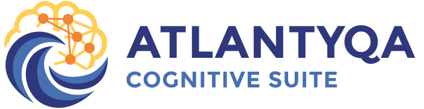
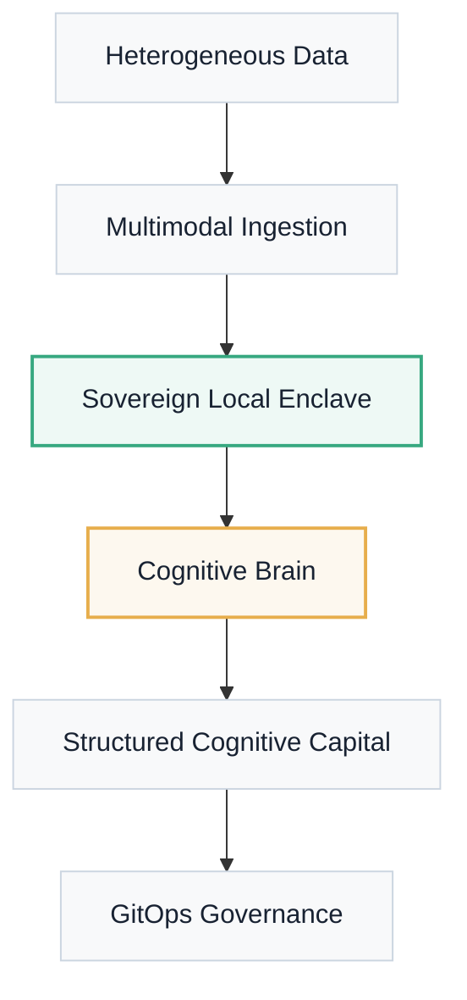

---
hide:
  - title
---

<div class="hero-sov" markdown="1">

<span class="sovereignty-badge">Local Enclave · Digital Sovereignty</span>



<p class="hero-subtitle">
The <strong>Cognitive Sovereignty</strong> platform that transforms raw data into structured cognitive capital, operating under absolute control of your infrastructure.
</p>

<div class="hero-cta">
  <a href="portal/quickstart/" class="btn-primary">Start Challenge</a>
  <a href="installation/" class="btn-secondary">Technical Architecture</a>
</div>

</div>

<div class="mantra-manifesto" markdown="1">
"We're not just here to build software. We train human judgment to cooperate with intelligent systems."
</div>

## Sovereign Cognitive Governance

<div class="tactical-container" markdown="1">

### Cognitive Capital Flow
Unlike traditional systems, Atlantyqa ensures that the data life cycle stays within your sovereign domain.



</div>

## Pillars of the Ecosystem

<div class="features-grid" markdown="1">

<div class="feature-card" markdown="1">
<div class="feature-icon">
  <svg xmlns="http://www.w3.org/2000/svg" viewBox="0 0 24 24"><path d="M12 2C6.48 2 2 6.48 2 12s4.48 10 10 10 10-4.48 10-10S17.52 2 12 2zm-1 17.93c-3.95-.49-7-3.85-7-7.93 0-.62.08-1.21.21-1.79L9 15v1c0 1.1.9 2 2 2v1.93zm6.9-2.54c-.26-.81-1-1.39-1.9-1.39h-1v-3c0-.55-.45-1-1-1H8v-2h2c.55 0 1-.45 1-1V7h2c1.1 0 2-.9 2-2v-.41c2.93 1.19 5 4.06 5 7.41 0 2.08-.8 3.97-2.1 5.39z"/></svg>
</div>
<h3 class="feature-title">Local-First Sovereignty</h3>
<p class="feature-description">
Execution in a private local enclave. Your data never leaves your machine, ensuring extreme regulatory compliance (GDPR/EUAI Act).
</p>
</div>

<div class="feature-card" markdown="1">
<div class="feature-icon">
  <svg xmlns="http://www.w3.org/2000/svg" viewBox="0 0 24 24"><path d="M12 2C6.48 2 2 6.48 2 12s4.48 10 10 10 10-4.48 10-10S17.52 2 12 2zm0 18c-4.41 0-8-3.59-8-8 0-.29.02-.58.05-.86 2.36-1.05 4.23-2.98 5.21-5.37C11.07 8.33 14.05 10 17.42 10c.78 0 1.53-.09 2.25-.26.21.71.33 1.47.33 2.26 0 4.41-3.59 8-8 8z"/></svg>
</div>
<h3 class="feature-title">Tactical AI Analysis</h3>
<p class="feature-description">
Advanced semantic engine based on spaCy and Transformers that extracts entities, risks, and sentiments without cloud dependencies.
</p>
</div>

<div class="feature-card" markdown="1">
<div class="feature-icon">
  <svg xmlns="http://www.w3.org/2000/svg" viewBox="0 0 24 24"><path d="M21 16.5C21 16.88 20.79 17.21 20.47 17.38L12.57 21.82C12.41 21.94 12.21 22 12 22C11.79 22 11.59 21.94 11.43 21.82L3.53 17.38C3.21 17.21 3 16.88 3 16.5V7.5C3 7.12 3.21 6.79 3.53 6.62L11.43 2.18C11.59 2.06 11.79 2 12 2C12.21 2 12.41 2.06 12.57 2.18L20.47 6.62C20.79 6.79 21 7.12 21 7.5V16.5Z"/></svg>
</div>
<h3 class="feature-title">GitOps Traceability</h3>
<p class="feature-description">
Every analyzed result is versioned and synchronized via Git, creating an immutable and collaborative audit trail.
</p>
</div>

</div>

## Cooperative Model

This project is born under a **cooperative work** framework. It is not simply a software product; it is a shared resource for communities seeking technological independence.

- **Learning by Doing**: Every contribution is a step in your talent progression.
- **Shared Capital**: Knowledge is structured and returned to the ATLANTYDE ecosystem.
- **Ethical Infrastructure**: Designed from Southern Europe for citizen empowerment.

---

<div class="quickstart-section" markdown="1">

### Rapid Deployment
Start your cognitive enclave in three commands:

```bash
# Sync and prepare
python cogctl.py init

# Ingest strategic information
python cogctl.py ingest <my_file.pdf>

# Generate cognitive capital
python cogctl.py analyze
```

</div>

<div class="cta-panel">
<p class="cta-panel__text">
Ready to secure your digital sovereignty?
</p>
<a href="portal/quickstart/" class="btn-primary btn-primary--inline">Start Learning Path →</a>
</div>
