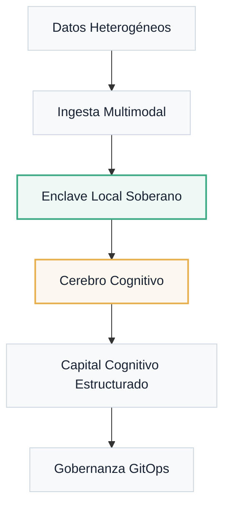

---
hide:
  - title
---

<div class="hero-sov" markdown="1">

<span class="sovereignty-badge">Enclave Local · Soberanía Digital</span>


<p class="hero-subtitle">
La plataforma de <strong>Soberanía Cognitiva</strong> que transforma datos brutos en capital cognitivo estructurado, operando bajo el control absoluto de tu infraestructura.
</p>

<div class="hero-cta">
  <a href="portal/quickstart/" class="btn-primary">Comenzar Desafío</a>
  <a href="installation/" class="btn-secondary">Arquitectura Técnica</a>
</div>

</div>


<div class="mantra-manifesto" markdown="1">
"No venimos solo a construir software. Entrenamos criterio humano para cooperar con sistemas inteligentes."
</div>

## Gobernanza Cognitiva Soberana

<div class="tactical-container" markdown="1">

### Flujo del Capital Cognitivo
A diferencia de los sistemas tradicionales, Atlantyqa asegura que el ciclo de vida del dato se mantenga dentro de tu dominio soberano.



</div>

## Pilares del Ecosistema

<div class="features-grid" markdown="1">

<div class="feature-card" markdown="1">
<div class="feature-icon">
  <svg xmlns="http://www.w3.org/2000/svg" viewBox="0 0 24 24"><path d="M12 2C6.48 2 2 6.48 2 12s4.48 10 10 10 10-4.48 10-10S17.52 2 12 2zm-1 17.93c-3.95-.49-7-3.85-7-7.93 0-.62.08-1.21.21-1.79L9 15v1c0 1.1.9 2 2 2v1.93zm6.9-2.54c-.26-.81-1-1.39-1.9-1.39h-1v-3c0-.55-.45-1-1-1H8v-2h2c.55 0 1-.45 1-1V7h2c1.1 0 2-.9 2-2v-.41c2.93 1.19 5 4.06 5 7.41 0 2.08-.8 3.97-2.1 5.39z"/></svg>
</div>
<h3 class="feature-title">Soberanía Local-First</h3>
<p class="feature-description">
Ejecución en enclave local privado. Tus datos nunca abandonan tu máquina, garantizando cumplimiento normativo extremo (GDPR/EUAI Act).
</p>
</div>

<div class="feature-card" markdown="1">
<div class="feature-icon">
  <svg xmlns="http://www.w3.org/2000/svg" viewBox="0 0 24 24"><path d="M12 2C6.48 2 2 6.48 2 12s4.48 10 10 10 10-4.48 10-10S17.52 2 12 2zm0 18c-4.41 0-8-3.59-8-8 0-.29.02-.58.05-.86 2.36-1.05 4.23-2.98 5.21-5.37C11.07 8.33 14.05 10 17.42 10c.78 0 1.53-.09 2.25-.26.21.71.33 1.47.33 2.26 0 4.41-3.59 8-8 8z"/></svg>
</div>
<h3 class="feature-title">Análisis Táctico IA</h3>
<p class="feature-description">
Motor semántico avanzado basado en spaCy y Transformers que extrae entidades, riesgos y sentimientos sin dependencias de la nube.
</p>
</div>

<div class="feature-card" markdown="1">
<div class="feature-icon">
  <svg xmlns="http://www.w3.org/2000/svg" viewBox="0 0 24 24"><path d="M21 16.5C21 16.88 20.79 17.21 20.47 17.38L12.57 21.82C12.41 21.94 12.21 22 12 22C11.79 22 11.59 21.94 11.43 21.82L3.53 17.38C3.21 17.21 3 16.88 3 16.5V7.5C3 7.12 3.21 6.79 3.53 6.62L11.43 2.18C11.59 2.06 11.79 2 12 2C12.21 2 12.41 2.06 12.57 2.18L20.47 6.62C20.79 6.79 21 7.12 21 7.5V16.5Z"/></svg>
</div>
<h3 class="feature-title">Trazabilidad GitOps</h3>
<p class="feature-description">
Cada resultado analizado se versiona y sincroniza mediante Git, creando un rastro de auditoría inmutable y colaborativo.
</p>
</div>

</div>

## Modelo Cooperativo

Este proyecto nace bajo un marco de **trabajo cooperativo**. No es simplemente un producto de software; es un recurso compartido para comunidades que buscan independencia tecnológica.

- **Learning by Doing**: Cada contribución es un paso en tu progresión de talento.
- **Capital Compartido**: El conocimiento se estructura y se devuelve al ecosistema ATLANTYDE.
- **Infraestructura Ética**: Diseñado desde el sur de Europa para el empoderamiento ciudadano.

---

<div class="quickstart-section" markdown="1">

### Despliegue Rápido
Inicia tu enclave cognitivo en tres comandos:

```bash
# Sincroniza y prepara
python cogctl.py init

# Ingesta información estratégica
python cogctl.py ingest <mi_archivo.pdf>

# Genera capital cognitivo
python cogctl.py analyze
```

</div>

<div class="cta-panel">
<p class="cta-panel__text">
¿Preparado para asegurar tu soberanía digital?
</p>
<a href="portal/quickstart/" class="btn-primary btn-primary--inline">Iniciar Learning Path →</a>
</div>
