# 🤝 Contribution Protocol

!!! abstract "Open Source Philosophy"
    This project lives through its community. Every PR is a brick in the building of digital sovereignty.

---

<div class="tactical-container tactical-container--compact">
  <h3 class="tactical-title">PR Lifecycle</h3>


</div>

```mermaid
graph TD
    Issue[🐛/✨ Issue] -->|Discussion| Branch[🌿 Feature Branch]
    Branch -->|Commit| PR[🔄 Pull Request]
    PR -->|CI/CD| Review[👀 Review]
    Review -->|Merge| Main[🚀 Main]

    style Issue fill:#e7ae4c,stroke:#333,stroke-width:2px,color:#fff
    style Branch fill:#37a880,stroke:#333,stroke-width:2px,color:#fff
    style PR fill:#e0e7ff,stroke:#333,stroke-width:2px,color:#182232
    style Review fill:#f1f5f9,stroke:#182232,stroke-width:2px,color:#182232
    style Main fill:#e0e7ff,stroke:#333,stroke-width:2px,color:#182232
```

## 1. 🏁 Before Starting

Assign yourself the work to avoid collisions.

1.  **Find an Issue**: Look for ones labeled `good first issue`.
2.  **Comment**: "I'd like to work on this".
3.  **Create Your Branch**:
    ```bash
    git checkout -b feature/my-improvement
    ```

---

## 2. 📦 The Perfect Pull Request

A PR gets accepted quickly if it's easy to review.

=== "✅ What it MUST have"
    *   **Clear Title**: `feat(ui): add dark mode` (Use Conventional Commits).
    *   **Context**: What problem does it solve?
    *   **Evidence**: Screenshots or logs if you changed something visual or logical.

=== "❌ What to AVOID"
    *   Unnecessary files (`.DS_Store`, `__pycache__`).
    *   Massive formatting changes (spaces vs tabs) in files you didn't touch.
    *   Secrets or tokens.

## 3. 📝 Checklist (Copy and Paste)

Use this in your PR description:

```markdown
## 🎯 Objective
[Describe what this change does]

## 📸 Evidence
- [ ] Local test logs attached.
- [ ] Screenshot (if applicable).

## 🛡️ Security Checklist
- [ ] No secrets included.
- [ ] Complies with Local-First data principle.
```

---

### Need Help?

If you get stuck, comment on the Issue or search the existing documentation. We're here to learn together!
