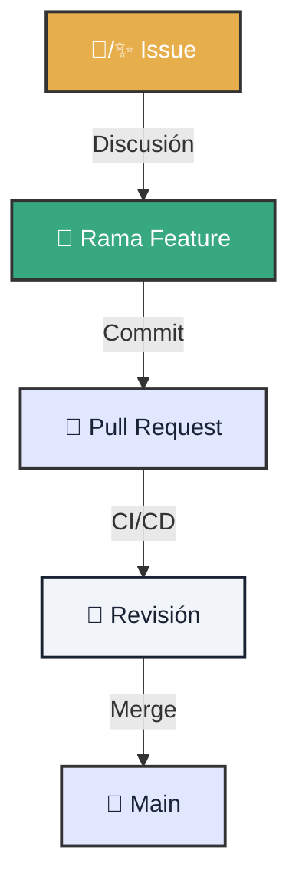

# 🤝 Protocolo de Contribución

!!! abstract "Filosofía Open Source"
    Este proyecto vive por su comunidad. Cada PR es un ladrillo en el edificio de la soberanía digital.

---

<div class="tactical-container tactical-container--compact">
  <h3 class="tactical-title">Ciclo de Vida del PR</h3>
  

</div>

## 1. 🏁 Antes de Empezar

Asignate el trabajo para evitar colisiones.

1.  **Busca un Issue**: Mira los etiquetados como `good first issue`.
2.  **Comenta**: "Me gustaría trabajar en esto".
3.  **Crea tu Rama**:
    ```bash
    git checkout -b feature/mi-mejora
    ```

---

## 2. 📦 El Pull Request Perfecto

Un PR se acepta rápido si es fácil de revisar.

=== "✅ Lo que DEBE tener"
    *   **Título Claro**: `feat(ui): añadir modo oscuro` (Usa Conventional Commits).
    *   **Contexto**: ¿Qué problema soluciona?
    *   **Evidencia**: Capturas de pantalla o logs si cambiaste algo visual o de lógica.

=== "❌ Lo que EVITA"
    *   Archivos innecesarios (`.DS_Store`, `__pycache__`).
    *   Cambios de formato masivos (espacios vs tabs) en archivos que no tocaste.
    *   Secretos o tokens.

## 3. 📝 Lista de Verificación (Copiar y Pegar)

Usa esto en la descripción de tu PR:

```markdown
## 🎯 Objetivo
[Describe qué hace este cambio]

## 📸 Evidencia
- [ ] Logs de prueba local adjuntos.
- [ ] Captura de pantalla (si aplica).

## 🛡️ Checklist de Seguridad
- [ ] No incluye secretos.
- [ ] Cumple con el principio de datos locales (Local-First).
```

---

### ¿Necesitas Ayuda?

Si te atascas, comenta en el Issue o busca en la documentación existente. ¡Estamos aquí para aprender juntos!
