# 🧭 Identity and Ecosystem: The Engine of Atlantyqa

!!! quote "Core Purpose"
    **Empower historically excluded citizens and territories** through humanistic technology, sovereign infrastructure, and a lasting cognitive legacy.

---

  <h3 class="tactical-title">Organic Architecture</h3>

```mermaid
graph TD
    Core(🏛️ ATLANTYQA) --> SL(🏢 Tech SL)
    Core --> Coop(🤝 Worker Cooperative)
    Core --> Fund(🎓 Cultural Foundation)

    SL --> Ops[GitOps & Infra]
    Coop --> Lab[Educational Labs & AI]
    Fund --> Cult[Cultural Legacy & Ethics]

    style Core fill:#e0e7ff,stroke:#333,stroke-width:3px,color:#182232
    style SL fill:#37a880,stroke:#333,stroke-width:2px,color:#fff
    style Coop fill:#e7ae4c,stroke:#333,stroke-width:2px,color:#fff
    style Fund fill:#f1f5f9,stroke:#182232,stroke-width:2px,color:#182232
```

## 1. 🧬 Project DNA

This is not just a code repository; it's the digital manifestation of a collective will.

    

        <h3>🧠 The Visionary (Kbza)</h3>
        
<strong>Roles:</strong> CEO · CIO · DevSecOps · Ethical Designer

        
From <strong>Southern Europe (Andalusia)</strong>, orchestrating a vision where technology serves humanity, not the other way around.

    

    

        <h3>🔥 The Engine (Community)</h3>
        <ul>
            <li><strong>Jaime:</strong> Leadership and strategy.</li>
            <li><strong>Loky:</strong> CPO Full Stack & Execution.</li>
            <li><strong>Culebra:</strong> Onboarding & Culture.</li>
            <li><strong>Alba & Gortazar:</strong> Legal & Intergenerational.</li>
        </ul>
    

## 2. ⚡ Sovereign Tech Stack

Our tools choose freedom and reproducibility over captive convenience.

=== "☁️ Infrastructure"
    *   **Orchestration**: MicroK8s, k3s (lightweight Kubernetes).
    *   **IaC**: Terraform, Ansible (Infrastructure as Code).
    *   **Hardware**: GPU laptops for 100% Local AI.

=== "🧠 Artificial Intelligence"
    *   **Models**: LLaMA3, Phi3, Whisper (Open Source).
    *   **Apps**: FastAPI, Streamlit, Gradio.
    *   **Agents**: YAML Agents, MCP (Model Context Protocol).

## 3. 🚀 Global Expansion Strategy

A phased cognitive conquest plan.

| Phase | Horizon | Territory | Objective |
| :--- | :--- | :--- | :--- |
| **I** | 2025–26 | **Southern Spain** | ITI consolidation and educational pilot. |
| **II** | 2026–27 | **Europe** | Expansion to Portugal, France, Germany. |
| **III** | 2028+ | **Global** | Landing in LATAM and USA. |

---

### 🔗 Connection Nodes

This repository is the meeting point to materialize this vision.

  <a href="../../adoption-plan/" class="btn-primary">View Adoption Plan</a>
  <a href="../../execution-plan/" class="btn-secondary">Technical Execution Plan</a>
  <a href="../metrics/" class="btn-secondary">Impact Metrics</a>

