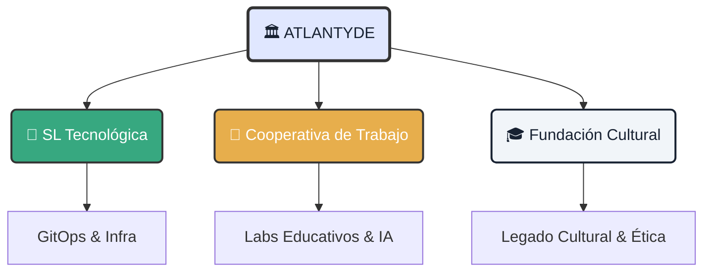

# 🧭 Identidad y Ecosistema: El Motor de Atlantyde

!!! quote "Propósito Central"
    **Empoderar a ciudadanos y territorios históricamente excluidos** mediante tecnología humanista, infraestructura soberana y un legado cognitivo duradero.

---

  <h3 class="tactical-title">Arquitectura Orgánica</h3>
  

## 1. 🧬 ADN del Proyecto

Este no es solo un repositorio de código; es la manifestación digital de una voluntad colectiva.

    

        <h3>🧠 El Visionario (Kbza)</h3>
        
<strong>Roles:</strong> CEO · CIO · DevSecOps · Diseñador Ético

        
Desde el <strong>Sur de Europa (Andalucía)</strong>, orquestando una visión donde la tecnología sirve al humano, no al revés.

    

    

        <h3>🔥 El Motor (Comunidad)</h3>
        <ul>
            <li><strong>Jaime:</strong> Liderazgo y estrategia.</li>
            <li><strong>Loky:</strong> CPO Full Stack & Ejecución.</li>
            <li><strong>Culebra:</strong> Onboarding & Cultura.</li>
            <li><strong>Alba & Gortazar:</strong> Legal & Intergeneracional.</li>
        </ul>
    

## 2. ⚡ Stack Tecnológico Soberano

Nuestras herramientas eligen la libertad y la reproducibilidad sobre la conveniencia cautiva.

=== "☁️ Infraestructura"
    *   **Orquestación**: MicroK8s, k3s (Kubernetes ligero).
    *   **IaC**: Terraform, Ansible (Infraestructura como Código).
    *   **Hardware**: Laptops con GPU para IA 100% Local.

=== "🧠 Inteligencia Artificial"
    *   **Modelos**: LLaMA3, Phi3, Whisper (Open Source).
    *   **Apps**: FastAPI, Streamlit, Gradio.
    *   **Agentes**: YAML Agents, MCP (Model Context Protocol).

## 3. 🚀 Estrategia de Expansión Global

Un plan de conquista cognitiva por fases.

| Fase | Horizonte | Territorio | Objetivo |
| :--- | :--- | :--- | :--- |
| **I** | 2025–26 | **Sur de España** | Consolidación ITI y piloto educativo. |
| **II** | 2026–27 | **Europa** | Expansión a Portugal, Francia, Alemania. |
| **III** | 2028+ | **Global** | Desembarco en LATAM y USA. |

---

### 🔗 Nodos de Conexión

Este repositorio es el punto de encuentro para materializar esta visión.

  <a href="../../adoption-plan/" class="btn-primary">Ver Plan de Adopción</a>
  <a href="../../execution-plan/" class="btn-secondary">Plan de Ejecución Técnica</a>
  <a href="../metrics/" class="btn-secondary">Métricas de Impacto</a>

