# 🤿 Lab 01: Deep Dive - Secure Pipeline

!!! tip "Mission Scenario"
    You are the new **Data Guardian** of Atlantyqa. You've been entrusted with a confidential document containing financial and personal data. Your mission: process it and extract intelligence without a single figure or real name touching the cloud.

---

## 1. 🗺️ Operations Map

Before touching a key, visualize the secure data flow.

```mermaid
graph TD
    Input[📄 Raw Document] -->|Ingest| Clean[🧹 Cleaning]
    Clean -->|Redaction with SpaCy| Safe[🛡️ Secure Tokens]
    Safe -->|Analysis| Json[💎 Final JSON]

    style Input fill:#e7ae4c,stroke:#333,stroke-width:2px,color:#fff
    style Clean fill:#37a880,stroke:#333,stroke-width:2px,color:#fff
    style Safe fill:#e0e7ff,stroke:#333,stroke-width:2px,color:#182232
    style Json fill:#f1f5f9,stroke:#182232,stroke-width:2px,color:#182232
```



## 2. ⚔️ Mission Execution

Follow the steps with surgical precision.

=== "Step 1: Ingest"
    Create a `confidential.txt` file in `data/input/` with fake (but realistic) data and execute it.

    ```bash
    python cogctl.py ingest confidential.txt
    ```

=== "Step 2: Armored Analysis"
    Activate the privacy shield. The `COGNITIVE_REDACT` variable is your best friend.

    ```bash
    # In PowerShell
    $env:COGNITIVE_REDACT="1"; python cogctl.py analyze

    # In Bash
    COGNITIVE_REDACT=1 python cogctl.py analyze
    ```

=== "Step 3: Verification"
    Check that the system worked. Open the resulting JSON.

    *   **Expected:** `"PERSON": "[REDACTED]"`
    *   **Failed:** `"PERSON": "Juan Pérez"`

---

## 3. 📸 Evidence Collection

To claim your reward (XP), you must present proof.

### Delivery Checklist
- [ ] **Output JSON**: Confirm there are no real names.
- [ ] **Audit Log**: Verify that `outputs/audit/` has a new entry.
- [ ] **Screenshot**: Show your terminal with the "Success" message.

<div class="feature-card">
    <h3>📝 Template for your Pull Request</h3>
    <pre><code>
## 🛡️ Lab 01 Mission Completed

- **File Hash:** [Insert Hash]
- **Redaction Status:** ✅ Activated
- **Incidents:** None

Evidence attached in /evidence folder.
    </code></pre>
</div>

---

### 🆘 Common Problems?

??? question "My document isn't processing"
    *   Is it in `data/input`?
    *   Does it have a `.txt` or `.pdf` extension?
    *   Do you have write permissions on `outputs/`?

??? question "I don't see redacted data"
    Make sure the environment variable is properly set. Do an `echo $env:COGNITIVE_REDACT` to check.
