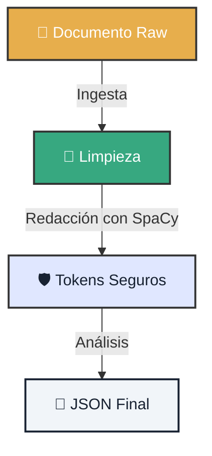

# 🤿 Lab 01: Inmersión Profunda (Deep Dive)

!!! tip "Escenario de Misión"
    Eres el nuevo **Data Guardian** de Atlantyqa. Se te ha confiado un documento confidencial con datos financieros y personales. Tu misión: procesarlo y extraer inteligencia sin que una sola cifra o nombre real toque la nube.

---

## 1. 🗺️ Mapa de Operaciones

Antes de tocar una tecla, visualiza el flujo de datos seguro.



## 2. ⚔️ Ejecución de la Misión

Sigue los pasos con precisión quirúrgica.

=== "Paso 1: Ingesta"
    Crea un archivo `confidencial.txt` en `data/input/` con datos falsos (pero realistas) y ejecútalo.

    ```bash
    python cogctl.py ingest confidencial.txt
    ```

=== "Paso 2: Análisis Blindado"
    Activa el escudo de privacidad. La variable `COGNITIVE_REDACT` es tu mejor amiga.

    ```bash
    # En PowerShell
    $env:COGNITIVE_REDACT="1"; python cogctl.py analyze

    # En Bash
    COGNITIVE_REDACT=1 python cogctl.py analyze
    ```

=== "Paso 3: Verificación"
    Comprueba que el sistema funcionó. Abre el JSON resultante.

    *   **Esperado:** `"PERSON": "[REDACTED]"`
    *   **Fallido:** `"PERSON": "Juan Pérez"`

---

## 3. 📸 Recolección de Evidencia

Para reclamar tu recompensa (XP), debes presentar pruebas.

### Checklist de Entrega
- [ ] **JSON de Salida**: Confirma que no hay nombres reales.
- [ ] **Log de Auditoría**: Verifica que `outputs/audit/` tiene una entrada nueva.
- [ ] **Captura de Pantalla**: Muestra tu terminal con el mensaje "Success".

<div class="feature-card">
    <h3>📝 Plantilla para tu Pull Request</h3>
    <pre><code>
## 🛡️ Misión Lab 01 Completada

- **Hash del Archivo:** [Insertar Hash]
- **Estado de Redacción:** ✅ Activado
- **Incidentes:** Ninguno

Adjunto evidencia en /evidence folder.
    </code></pre>
</div>

---

### 🆘 ¿Problemas Comunes?

??? question "Mi documento no se procesa"
    *   ¿Está en `data/input`?
    *   ¿Tiene extensión `.txt` o `.pdf`?
    *   ¿Tienes permisos de escritura en `outputs/`?

??? question "No veo datos redactados"
    Asegúrate de que la variable de entorno está bien seteada. Haz un `echo $env:COGNITIVE_REDACT` para comprobar.
