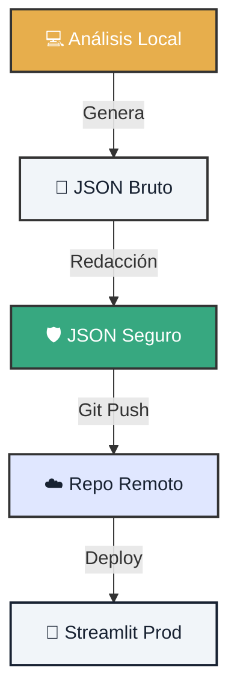

# 🔐 Lab 02: GitOps Steward - Sincronización Segura

!!! tip "Escenario de Misión"
    Eres el **GitOps Steward** de Atlantyqa. Has completado análisis locales y ahora debes sincronizar resultados con el repositorio remoto **sin filtrar ni un solo byte sensible**. Tu misión: dominar el flujo GitOps seguro.

---

## 1. 🗺️ Mapa de Operaciones

Antes de sincronizar, visualiza el flujo de datos seguro.



## 2. ⚔️ Ejecución de la Misión

Sigue los pasos con precisión quirúrgica.

=== "Paso 1: Análisis Local"
    Primero, genera datos locales (deberías tener esto del Lab 01).

    ```bash
    python cogctl.py ingest contrato.pdf
    python cogctl.py analyze
    ```

    **Resultado esperado:** `outputs/raw/analysis.json` creado.

=== "Paso 2: Activar Modo Producción"
    Configura las variables de entorno para activar el escudo de privacidad.

    ```bash
    # En PowerShell
    $env:COGNITIVE_ENV="prod"
    $env:GITOPS_DATA_MODE="redacted"
    $env:COGNITIVE_HASH_SALT="mi_salt_secreto_123"

    # En Bash
    export COGNITIVE_ENV=prod
    export GITOPS_DATA_MODE=redacted
    export COGNITIVE_HASH_SALT=mi_salt_secreto_123
    ```

=== "Paso 3: Redactar Datos Sensibles"
    Ejecuta el script de redacción que enmascara información personal.

    ```bash
    python pipeline/redact.py --input outputs/raw --output outputs/insights
    ```

    **Verificación crítica:** Abre `outputs/insights/analysis.json` y confirma:
    *   ✅ Nombres propios → `[REDACTED_PERSON_001]`
    *   ✅ Emails → `[REDACTED_EMAIL]`
    *   ✅ Números de cuenta → `[REDACTED_ACCOUNT]`

=== "Paso 4: Sincronización GitOps"
    Ahora sí, sincroniza SOLO los datos seguros. El comando `-f` (force) es necesario porque la carpeta `outputs/` está protegida por defecto en `.gitignore`.

    ```bash
    # Añadimos forzosamente el resultado seguro
    git add -f outputs/insights/analysis.json

    # Commit con mensaje descriptivo
    git commit -m "feat(data): entrega Lab 02 - análisis redactado y seguro"

    # Push a tu rama actual (para simular el sync)
    git push origin fix/i18n-footer-mobile
    ```

    > **⚠️ NUNCA hagas:** `git add outputs/raw/` - ¡Contiene datos sin redactar!

---

## 3. 📸 Evidencia de Cumplimiento

Para reclamar tu recompensa (100 XP), debes presentar pruebas.

### Checklist de Entrega
- [ ] **Archivo Redactado**: `outputs/insights/analysis.json` sin datos personales.
- [ ] **Commit Hash**: Hash del commit que subiste al repo.
- [ ] **Screenshot**: Captura del diff de Git mostrando solo archivos seguros.
- [ ] **Audit Log**: Entrada en `outputs/audit/gitops_sync.log` con timestamp.

<div class="feature-card">
    <h3>📝 Template para tu Pull Request</h3>
    <pre><code>
## 🔐 Lab 02 Misión Completada

- **Commit Hash:** [Insertar hash]
- **Archivos Sincronizados:** outputs/insights/analysis.json
- **Datos Sensibles Filtrados:** ✅ Sí
- **Modo GitOps:** Producción

Evidencia adjunta en /evidence folder.
    </code></pre>
</div>

---

## 4. 🛡️ Validación de Seguridad
Antes de hacer push, ejecuta esta validación automática para asegurar la soberanía de los datos:

=== "Multiplataforma (Recomendado)"
    ```bash
    # Ejecuta el validador cognitivo
    python scripts/validate_gitops.py
    ```

=== "🔎 ¿Qué hace este script?"
    Analiza los archivos preparados (`git add`) y busca patrones sensibles (DNI, CIF, nombres reales). Si detecta algo que la redacción se ha saltado, bloqueará el proceso por seguridad.

??? example "Código del Validador"
    Este script está en `scripts/validate_gitops.py` y es compatible con Windows y Linux.

### 🆘 Problemas Comunes

??? question "Git rechaza mi push"
    *   ¿Configuraste el remote correctamente? Verifica con `git remote -v`
    *   ¿Tienes permisos de escritura en el repo?

??? question "No veo archivos redactados"
    Asegúrate de que las variables de entorno están activas: `echo $COGNITIVE_ENV`

---

### 🎯 Siguiente Nivel

Has dominado la sincronización segura. Ahora aprende a visualizar estos datos.

<div class="hero-cta hero-cta--start hero-cta--mt-3">
  <a href="../lab-03-bootstrap-dashboard/" class="btn-primary">Ir a Lab 03: Dashboard →</a>
  <a href="../talent-challenge-labs/" class="btn-secondary">Volver a Labs</a>
</div>
