# 🎨 Lab 03: Bootstrap Dashboard - Your Command Center

!!! tip "Mission Scenario"
    You are the **Dashboard Architect** of Atlantyqa. You have processed data and now must create a **visual command center** where analysts can explore insights without touching a line of code. Your mission: raise an operational dashboard in less than 5 minutes.

---

## 1. 🗺️ Architecture Map

Visualize how components connect.

```mermaid
graph TD
    User[👤 Analyst] -->|Browser| UI[📊 Streamlit UI]
    UI -->|Reads| Insights[📂 outputs/insights/]
    UI -->|Verifies| Auth[🔐 Token Auth]
    Insights -->|Renders| Charts[📈 Charts]

    style User fill:#e7ae4c,stroke:#333,stroke-width:2px,color:#fff
    style UI fill:#37a880,stroke:#333,stroke-width:2px,color:#fff
    style Insights fill:#f1f5f9,stroke:#333,stroke-width:2px,color:#182232
    style Auth fill:#e0e7ff,stroke:#333,stroke-width:2px,color:#182232
    style Charts fill:#f1f5f9,stroke:#182232,stroke-width:2px,color:#182232
```



## 2. ⚔️ Mission Execution

Follow the steps to raise your dashboard.

=== "Step 1: Prepare Test Data"
    If you don't have data from Lab 01/02, generate demo data.

    ```bash
    # Demo ingestion
    python cogctl.py ingest sample_report.pdf

    # Analysis
    python cogctl.py analyze
    ```

    **Verification:** Confirm that `outputs/insights/analysis.json` exists

=== "Step 2: Configure Variables (Optional)"
    For development mode, you don't need authentication. For production:

    ```bash
    # In PowerShell
    $env:COGNITIVE_ENV="prod"
    $env:COGNITIVE_UI_TOKEN_ADMIN="my_secret_token_123"

    # In Bash
    export COGNITIVE_ENV=prod
    export COGNITIVE_UI_TOKEN_ADMIN=my_secret_token_123
    ```

=== "Step 3: Launch Dashboard"
    Run Streamlit and open the browser.

    ```bash
    streamlit run frontend/streamlit_app.py --server.port 8501
    ```

    **Access:** Open your browser at `http://localhost:8501`

    **You should see:**
    *   📊 Chart of detected entities
    *   📈 Events timeline
    *   🚨 Risk alerts (if any)
    *   📄 Executive summary

=== "Step 4: Customize Dashboard"
    Edit `frontend/streamlit_app.py` to add your own widget.

    ```python
    import streamlit as st
    import json

    # Load data
    with open('outputs/insights/analysis.json') as f:
        data = json.load(f)

    # Your custom widget
    st.subheader("🎯 My Custom Metric")
    st.metric("Total Entities", len(data.get('entities', [])))
    ```

    **Hot Reload:** Streamlit automatically reloads when saving changes.

---

## 3. 📸 Compliance Evidence

To claim your reward (75 XP), you must present proof.

### Delivery Checklist
- [ ] **Dashboard Screenshot**: Capture showing the working dashboard.
- [ ] **Custom Widget**: Code for at least 1 widget you added.
- [ ] **Access URL**: Confirm it works at `localhost:8501`
- [ ] **Streamlit Logs**: Terminal capture showing "You can now view your Streamlit app"

<div class="feature-card">
    <h3>📝 Template for your Pull Request</h3>
    <pre><code>
## 🎨 Lab 03 Mission Completed

- **Dashboard URL:** http://localhost:8501
- **Widgets Added:** [Describe custom widgets]
- **Data Visualized:** ✅ Yes
- **Mode:** Local Development

Screenshots attached in /evidence folder.
    </code></pre>
</div>

---

## 4. 🎨 Optional Improvements (Bonus XP)

Want to stand out? Implement these improvements:

<div class="features-grid">
    <div class="feature-card">
        <h3>🌙 Dark Mode</h3>
        <p>Add a toggle to switch between light and dark theme.</p>
        <p><strong>Bonus:</strong> +10 XP</p>
    </div>
    <div class="feature-card">
        <h3>📥 Export PDF</h3>
        <p>Button to export the dashboard as PDF.</p>
        <p><strong>Bonus:</strong> +15 XP</p>
    </div>
    <div class="feature-card">
        <h3>🔔 Real-time Alerts</h3>
        <p>Notification system for new analyses.</p>
        <p><strong>Bonus:</strong> +20 XP</p>
    </div>
</div>

---

### 🆘 Common Problems

??? question "Streamlit won't start"
    *   Did you install Streamlit? `pip install streamlit`
    *   Is port 8501 occupied? Use `--server.port 8502`

??? question "I don't see data on the dashboard"
    *   Verify that `outputs/insights/analysis.json` exists
    *   Check the path in the code: it should point to `outputs/insights/`

---

### 🎯 Next Level

You've created your visual command center. Congratulations!

<div class="hero-cta hero-cta--start hero-cta--mt-3">
  <a href="../contributing/" class="btn-primary">Contribute to Project →</a>
  <a href="../talent-challenge-labs/" class="btn-secondary">Back to Labs</a>
</div>
