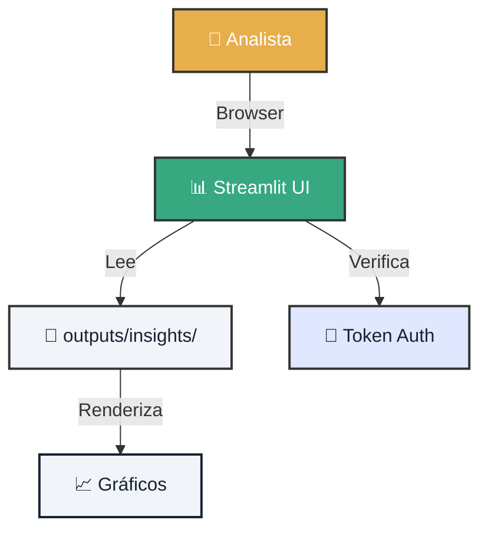

# 🎨 Lab 03: Bootstrap Dashboard - Tu Centro de Comando

!!! tip "Escenario de Misión"
    Eres el **Dashboard Architect** de Atlantyqa. Tienes datos procesados y ahora debes crear un **centro de comando visual** donde los analistas puedan explorar insights sin tocar una línea de código. Tu misión: levantar un dashboard operativo en menos de 5 minutos.

---

## 1. 🗺️ Mapa de Arquitectura

Visualiza cómo los componentes se conectan.



## 2. ⚔️ Ejecución de la Misión

Sigue los pasos para levantar tu dashboard.

=== "Paso 1: Preparar Datos de Prueba"
    Si no tienes datos del Lab 01/02, genera datos de demostración.

    ```bash
    # Ingesta demo
    python cogctl.py ingest sample_report.pdf

    # Análisis
    python cogctl.py analyze
    ```

    **Verificación:** Confirma que existe `outputs/insights/analysis.json`

=== "Paso 2: Configurar Variables (Opcional)"
    Para modo desarrollo, no necesitas autenticación. Para producción:

    ```bash
    # En PowerShell
    $env:COGNITIVE_ENV="prod"
    $env:COGNITIVE_UI_TOKEN_ADMIN="mi_token_secreto_123"

    # En Bash
    export COGNITIVE_ENV=prod
    export COGNITIVE_UI_TOKEN_ADMIN=mi_token_secreto_123
    ```

=== "Paso 3: Lanzar Dashboard"
    Ejecuta Streamlit y abre el navegador.

    ```bash
    streamlit run frontend/streamlit_app.py --server.port 8501
    ```

    **Acceso:** Abre tu navegador en `http://localhost:8501`

    **Deberías ver:**
    *   📊 Gráfico de entidades detectadas
    *   📈 Timeline de eventos
    *   🚨 Alertas de riesgo (si las hay)
    *   📄 Resumen ejecutivo

=== "Paso 4: Personalizar Dashboard"
    Edita `frontend/streamlit_app.py` para añadir tu propio widget.

    ```python
    import streamlit as st
    import json

    # Cargar datos
    with open('outputs/insights/analysis.json') as f:
        data = json.load(f)

    # Tu widget personalizado
    st.subheader("🎯 Mi Métrica Custom")
    st.metric("Total Entidades", len(data.get('entities', [])))
    ```

    **Hot Reload:** Streamlit recarga automáticamente al guardar cambios.

---

## 3. 📸 Evidencia de Cumplimiento

Para reclamar tu recompensa (75 XP), debes presentar pruebas.

### Checklist de Entrega
- [ ] **Screenshot del Dashboard**: Captura mostrando el dashboard funcionando.
- [ ] **Widget Personalizado**: Código de al menos 1 widget que añadiste.
- [ ] **URL de Acceso**: Confirma que funciona en `localhost:8501`
- [ ] **Logs de Streamlit**: Captura del terminal mostrando "You can now view your Streamlit app"

<div class="feature-card">
    <h3>📝 Template para tu Pull Request</h3>
    <pre><code>
## 🎨 Lab 03 Misión Completada

- **Dashboard URL:** http://localhost:8501
- **Widgets Añadidos:** [Describir widgets personalizados]
- **Datos Visualizados:** ✅ Sí
- **Modo:** Desarrollo Local

Screenshots adjuntos en /evidence folder.
    </code></pre>
</div>

---

## 4. 🎨 Mejoras Opcionales (Bonus XP)

¿Quieres destacar? Implementa estas mejoras:

<div class="features-grid">
    <div class="feature-card">
        <h3>🌙 Modo Oscuro</h3>
        <p>Añade un toggle para cambiar entre tema claro y oscuro.</p>
        <p><strong>Bonus:</strong> +10 XP</p>
    </div>
    <div class="feature-card">
        <h3>📥 Exportar PDF</h3>
        <p>Botón para exportar el dashboard como PDF.</p>
        <p><strong>Bonus:</strong> +15 XP</p>
    </div>
    <div class="feature-card">
        <h3>🔔 Alertas en Tiempo Real</h3>
        <p>Sistema de notificaciones para nuevos análisis.</p>
        <p><strong>Bonus:</strong> +20 XP</p>
    </div>
</div>

---

### 🆘 Problemas Comunes

??? question "Streamlit no arranca"
    *   ¿Instalaste Streamlit? `pip install streamlit`
    *   ¿El puerto 8501 está ocupado? Usa `--server.port 8502`

??? question "No veo datos en el dashboard"
    *   Verifica que `outputs/insights/analysis.json` existe
    *   Revisa la ruta en el código: debe apuntar a `outputs/insights/`

---

### 🎯 Siguiente Nivel

Has creado tu centro de comando visual. ¡Felicidades!

<div class="hero-cta hero-cta--start hero-cta--mt-3">
  <a href="../contributing/" class="btn-primary">Contribuir al Proyecto →</a>
  <a href="../talent-challenge-labs/" class="btn-secondary">Volver a Labs</a>
</div>
