# 🧭 Learning Path: From Explorer to Strategist

!!! abstract "Mission Objective"
    Master the sovereign cognitive lifecycle. Advance levels by solving **Learning Challenges** (`learning-task`) and unlock new capabilities for the ecosystem.

---

  <h3 class="tactical-title tactical-title--spaced">🗺️ Capabilities Map</h3>

```mermaid
graph TD
    L1(🟢 Cognitive Explorer) --> L2(🔵 Sense Builder)
    L2 --> L3(🟣 Cognitive Engineer)
    L3 --> L4(⚫ Strategic Cooperator)

    style L1 fill:#e7ae4c,stroke:#333,stroke-width:2px,color:#fff
    style L2 fill:#37a880,stroke:#333,stroke-width:2px,color:#fff
    style L3 fill:#e0e7ff,stroke:#333,stroke-width:2px,color:#182232
    style L4 fill:#f1f5f9,stroke:#182232,stroke-width:2px,stroke-dasharray: 5 5,color:#182232
```

## Mastery Levels

=== "🟢 Level 1: Explorer"
    

        <h3>Cognitive Explorer</h3>
        
<strong>Focus:</strong> Understand the terrain and basic tools.

        <ul>
            <li>✅ Install the environment (`cogctl init`).</li>
            <li>✅ Run your first document analysis.</li>
            <li>✅ Understand the JSON output structure.</li>
        </ul>
        
<em>Reward: "Junior Analyst" Badge</em>

    

=== "🔵 Level 2: Builder"
    

        <h3>Sense Builder</h3>
        
<strong>Focus:</strong> Improve ingestion and visualization.

        <ul>
            <li>✅ Customize the data cleaning pipeline.</li>
            <li>✅ Create simple visualizations in Streamlit.</li>
            <li>✅ Report a bug with full traceability.</li>
        </ul>
    

=== "🟣 Level 3: Engineer"
    

        <h3>Cognitive Engineer</h3>
        
<strong>Focus:</strong> Automation and Orchestration (GitOps).

        <ul>
            <li>✅ Automate deployments with CI/CD.</li>
            <li>✅ Integrate new NLP models (spaCy/Transformers).</li>
            <li>✅ Optimize inference performance.</li>
        </ul>
    

=== "⚫ Level 4: Strategist"
    

        <h3>Strategic Cooperator</h3>
        
<strong>Focus:</strong> Architecture and Governance.

        <ul>
            <li>✅ Propose architecture RFCs (Request for Comments).</li>
            <li>✅ Define data governance policies.</li>
            <li>✅ Mentor new Explorers.</li>
        </ul>
    

  

## 🛠️ How to Progress

Learning is active. No exams, only real missions.

1.  **Find a Mission**: Go to the [Issues](https://github.com/atlantyqa-labs/cognitive-suite/issues) tab and filter by the `learning-task` label.
2.  **Execute and Document**: Solve the problem in your local environment.
3.  **Share**: Submit a small Pull Request (PR).

!!! tip "Pro Tip"
    A perfect PR isn't just code. It includes:
    *   **Context**: Why are you making this change?
    *   **Evidence**: Screenshots or logs of "before" and "after".

---

  <a href="../talent-challenge-labs/" class="btn-primary">View Challenge Labs →</a>
  <a href="https://github.com/atlantyqa-labs/cognitive-suite/issues/new/choose" class="btn-secondary" target="_blank">Open New Issue</a>

