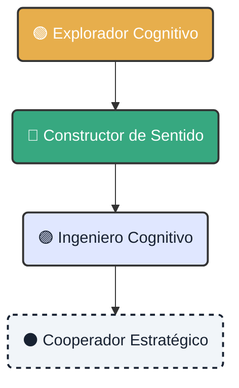

# 🧭 Ruta de Aprendizaje: De Explorador a Estratega

!!! abstract "Objetivo de la Misión"
    Dominar el ciclo de vida cognitivo soberano. Avanza niveles resolviendo **Retos de Aprendizaje** (`learning-task`) y desbloquea nuevas capacidades para el ecosistema.

---

  <h3 class="tactical-title tactical-title--spaced">🗺️ Mapa de Capacidades</h3>
  

## Niveles de Maestría

=== "🟢 Nivel 1: Explorador"
    

        <h3>Explorador Cognitivo</h3>
        
<strong>Enfoque:</strong> Entender el terreno y las herramientas básicas.

        <ul>
            <li>✅ Instalar el entorno (`cogctl init`).</li>
            <li>✅ Ejecutar tu primer análisis de documento.</li>
            <li>✅ Entender la estructura de salida JSON.</li>
        </ul>
        
<em>Recompensa: Insignia de "Analista Junior"</em>

    

=== "🔵 Nivel 2: Constructor"
    

        <h3>Constructor de Sentido</h3>
        
<strong>Enfoque:</strong> Mejorar la ingesta y visualización.

        <ul>
            <li>✅ Personalizar el pipeline de limpieza de datos.</li>
            <li>✅ Crear visualizaciones simples en Streamlit.</li>
            <li>✅ Reportar un bug con trazabilidad completa.</li>
        </ul>
    

=== "🟣 Nivel 3: Ingeniero"
    

        <h3>Ingeniero Cognitivo</h3>
        
<strong>Enfoque:</strong> Automatización y Orquestación (GitOps).

        <ul>
            <li>✅ Automatizar despliegues con CI/CD.</li>
            <li>✅ Integrar nuevos modelos de NLP (spaCy/Transformers).</li>
            <li>✅ Optimizar rendimiento de inferencia.</li>
        </ul>
    

=== "⚫ Nivel 4: Estratega"
    

        <h3>Cooperador Estratégico</h3>
        
<strong>Enfoque:</strong> Arquitectura y Gobernanza.

        <ul>
            <li>✅ Proponer RFCs (Request for Comments) de arquitectura.</li>
            <li>✅ Definir políticas de gobernanza de datos.</li>
            <li>✅ Mentoring a Exploradores nuevos.</li>
        </ul>
    

  

## 🛠️ Cómo Progresar

El aprendizaje es activo. No hay exámenes, solo misiones reales.

1.  **Busca una Misión**: Ve a la pestaña de [Issues](https://github.com/atlantyqa-labs/cognitive-suite/issues) y filtra por la etiqueta `learning-task`.
2.  **Ejecuta y Documenta**: Resuelve el problema en tu entorno local.
3.  **Comparte**: Envía un Pull Request (PR) pequeño.

!!! tip "Tip Pro"
    Un PR perfecto no es solo código. Incluye:
    *   **Contexto**: ¿Por qué haces este cambio?
    *   **Evidencia**: Capturas de pantalla o logs del "antes" y "después".

---

  <a href="../talent-challenge-labs/" class="btn-primary">Ver Labs de Desafío →</a>
  <a href="https://github.com/atlantyqa-labs/cognitive-suite/issues/new/choose" class="btn-secondary" target="_blank">Abrir Nuevo Issue</a>

