# 📊 Impact Metrics: Learning and Ecosystem

!!! quote "Measurement Philosophy"
    **We don't measure to control, but to learn.** We seek to capture learning velocity, operational reliability, and community growth without falling into vanity metrics.

---

  <h3 class="tactical-title">Cognitive Value Cycle</h3>

```mermaid
graph TD
    A[💡 Idea / Challenge] --> B[💻 Local Execution]
    B --> C[🔄 PR & Review]
    C --> D[🚀 Merge & Deploy]
    D --> E[🎓 Lesson Learned]

    style A fill:#e7ae4c,stroke:#333,stroke-width:2px,color:#fff
    style B fill:#37a880,stroke:#333,stroke-width:2px,color:#fff
    style C fill:#e0e7ff,stroke:#333,stroke-width:2px,color:#182232
    style D fill:#f1f5f9,stroke:#182232,stroke-width:2px,color:#182232
    style E fill:#ffffff,stroke:#182232,stroke-width:2px,stroke-dasharray: 5 5,color:#182232
```

## 1. 🎓 Learning Metrics (Gamification)

We instrument **GitHub Projects** to make learning visible and rewarded.

    

        <h3>🚀 TTFP (Time to First PR)</h3>
        
<strong>The Queen Metric.</strong> Time from when a user says "Hello" until their first PR is accepted. If it goes down, our onboarding is world-class.

    

    

        <h3>⚡ Learning Velocity</h3>
        
Number of `learning-task` issues completed per week. Measures the health and curiosity of the active cohort.

    

### Experience System (XP)

We reward real impact, not time in the chair.

| Task Level | Reward (XP) | Example |
| :--- | :--- | :--- |
| **Level 1** | `10 XP` | First analysis, simple fix |
| **Level 2** | `25 XP` | New visualization, docs improvement |
| **Level 3** | `50 XP` | CI/CD automation, new model |
| **Level 4** | `100 XP` | Architecture, governance, mentoring |

---

## 2. ⚙️ Flow & Reliability Metrics

To ensure sustainable deliveries and prevent burnout.

    

        <h3>Cycle Time</h3>
        
Time from <code>In Progress</code> to <code>Done</code>. Goal: Reduce blocks and external waits.

    

    

        <h3>CI Reliability</h3>
        
Percentage of green builds ('Success'). A broken pipeline blocks learning.

    

    

        <h3>Sovereign Adoption</h3>
        
% of PRs that respect the <strong>Local-First</strong> principle. No hidden cloud dependencies.

    

---

## 3. 🌍 Ecosystem Metrics

Connecting code with territorial impact.

*   ✅ **GitOps Coverage**: % of components with IaC and reproducible pipelines.
*   ✅ **Territorial Impact**: Number of community events and active students in target regions (ITI Andalusia, EU, LATAM).

---

## 4. 🛠️ Quick Implementation (15 min)

Configure your **GitHub Project v2** to start measuring today.

=== "1. Configure Fields"
    Create the following custom columns:
    *   `Status`: Backlog, In Progress, Review, Done.
    *   `Area`: Learning, GitOps, Docs, Backend.
    *   `XP` (Number): To sum scores.
    *   `KPI` (Text): Labels like "TTFP", "Reliability".

=== "2. Automate"
    *   Activate `add_to_project.yml` workflows.
    *   Use labels to assign XP automatically.

> **Remember:** If measured poorly, it destroys culture. We measure to improve the system, never to judge people.
