# 📊 Métricas de Impacto: Aprendizaje y Ecosistema

!!! quote "Filosofía de Medición"
    **No medimos para controlar, sino para aprender.** Buscamos capturar la velocidad de aprendizaje, la fiabilidad operativa y el crecimiento de la comunidad sin caer en métricas de vanidad.

---

<div class="tactical-container tactical-container--compact">
  <h3 class="tactical-title">Ciclo de Valor Cognitivo</h3>


</div>

```mermaid
graph TD
    A[💡 Idea / Reto] --> B[💻 Ejecución Local]
    B --> C[🔄 PR & Review]
    C --> D[🚀 Merge & Deploy]
    D --> E[🎓 Lección Aprendida]

    style A fill:#e7ae4c,stroke:#333,stroke-width:2px,color:#fff
    style B fill:#37a880,stroke:#333,stroke-width:2px,color:#fff
    style C fill:#e0e7ff,stroke:#333,stroke-width:2px,color:#182232
    style D fill:#f1f5f9,stroke:#182232,stroke-width:2px,color:#182232
    style E fill:#ffffff,stroke:#182232,stroke-width:2px,stroke-dasharray: 5 5,color:#182232
```

## 1. 🎓 Métricas de Aprendizaje (Gamificación)

Instrumentamos **GitHub Projects** para que el aprendizaje sea visible y recompensado.

<div class="features-grid">
    <div class="feature-card">
        <h3>🚀 TTFP (Time to First PR)</h3>
        <p><strong>La Métrica Reina.</strong> Tiempo desde que un usuario dice "Hola" hasta que su primer PR es aceptado. Si baja, nuestro onboarding es de clase mundial.</p>
    </div>
    <div class="feature-card">
        <h3>⚡ Learning Velocity</h3>
        <p>Número de issues `learning-task` completados por semana. Mide la salud y curiosidad de la cohorte activa.</p>
    </div>
</div>

### Sistema de Experiencia (XP)

Recompensamos el impacto real, no el tiempo en la silla.

| Nivel de Tarea | Recompensa (XP) | Ejemplo |
| :--- | :--- | :--- |
| **Nivel 1** | `10 XP` | Primer análisis, corrección simple |
| **Nivel 2** | `25 XP` | Nueva visualización, mejora de docs |
| **Nivel 3** | `50 XP` | Automatización CI/CD, nuevo modelo |
| **Nivel 4** | `100 XP` | Arquitectura, gobernanza, mentoring |

## 🏅 Badge Propietario (Owner Badge)

El **Badge Propietario** reconoce a early adopters que han alcanzado
un nivel de confianza elevado manteniéndose aún en fase temprana.

### Requisitos
- Pull Request aprobada por **CODEOWNERS**
- Autor con **≤ 10 contribuciones públicas** en el repositorio
- Revisión aprobada registrada vía GitHub API

### Flujo automático
1. CODEOWNERS aprueba la PR
2. El workflow verifica el número total de commits del autor
3. Si cumple el umbral:
   - Se marca el item del **Project v2** como `codeowner-approved`
   - Se actualiza `early-adopters.json`
   - Se añade comentario en la PR con el badge SVG

### Beneficios
- 🧠 **XP extra** en métricas de talento
- 🏷️ Distintivo visible en PRs y portal
- 🚀 Prioridad en labs y challenges avanzados

### Badge visual
El sistema muestra el siguiente SVG institucional:

`docs/assets/badge-owner.png`

> Las reglas dinámicas de XP residen en `metrics/xp-rules.yml`. Cambiar esa configuración ajusta la recompensa (`base_xp`, multiplicadores y niveles) sin tocar los flujos de GitHub Actions ni los scripts de aprobación.

## Ledger cognitivo de usuarios

Registramos el estado de cada contribuidor early-adopter en `metrics/users/<username>.json`. Este ledger auditable incluye:

- `xp`: total actual.
- `level`: nivel fiscalizado (`L0`, `L1`, …).
- `badges`: mapa de badges con timestamp, XP otorgado y PR de origen.
- `history`: lista ordenada de eventos (`badge`, `xp`, `feedback`, …).
- `last_seen`: ISO8601 de la última interacción (opcional).
- `feedback`: colección de notas cualitativas o enlaces a discussions (opcional).

Por ejemplo, `metrics/users/octocat.json` contiene el `owner_badge` adjudicado el `2026-02-06T18:40:00Z` y el XP correspondiente. Cada actualización puede registrarse por el workflow (o manualmente) y versionarse junto al repo para mantener trazabilidad y portabilidad.

> El script `scripts/validate-gamification.py` se ejecuta en `ci-python` para garantizar que la config declarativa (`metrics/xp-rules.yml`) y cada ledger en `metrics/users/` sigan el esquema esperado.

## Por qué esto es sólido

- ✅ **Declarativo**: `metrics/xp-rules.yml` define XP, multiplicadores y niveles; cambia el fichero y el flujo sigue funcionando sin tocar código.
- 🧾 **Auditable**: cada ledger `metrics/users/<username>.json` se versiona, se valida y se puede consultar como registro histórico.
- ⚙️ **Escalable**: puedes añadir nuevos badges, misiones o niveles sin reescribir workflows; el mismo script se adapta con más reglas.
- 📦 **Portable**: los ledgers y SVG pueden exportarse a una API, dashboard o certificación exterior sin depender de servicios externos.
- 📚 **Compatible**: se integra con Project v2, el talent portal y los planes de labs para priorizar el talento que realmente juega, aprende y colabora.

Esto ya te permite:
- Rankings no tóxicos.
- Itinerarios formativos.
- Priorizar talento real basándote en evidencia.

### Secrets requeridos
- `GITHUB_TOKEN` (token automático, pero necesita permisos ampliados sobre `contents`, `pull_requests`, `issues` y `projects`)
- `CODEOWNERS_TOKEN` (o PAT equivalente) para leer la membresía de CODEOWNERS y aplicar la etiqueta `codeowner-approved`
- `PROJECT_TOKEN` (PAT con acceso a Projects v2) y `PROJECT_URL` para mover ítems a `Done`

### Permisos mínimos
- `repository contents: write` (actualizar `early-adopters.json`, comentarios, etiquetas)
- `pull_requests: write` (leer reviews, añadir comentarios y etiquetas)
- `issues: write`
- `projects: write` (Project v2)

### ✍️ Credenciales firmadas por LAB completado
Cada lab aprobado emite una credencial verificable basada en Open Badges para que el talento pueda compartirla en CVs, portfolios o wallets futuras. El template declarativo vive en `credentials/templates/lab-credential.json` y admite placeholders como `{{github_user}}`, `{{uuid}}` o `{{detached_signature}}`.

La firma recomendada es Ed25519 y se realiza dentro del workflow al cerrar el lab:

```
echo "$PAYLOAD" | openssl dgst -sha256 -sign private.key > signature.sig
```

La credencial firmada se graba en `credentials/users/<user>/LAB-010.json`, se commitea y permanece como ledger verificable y portátil. Así queda probada la evidencia técnica (PR, CI, commits) sin necesidad de backend adicional.

### 🏛️ Roles regulatorios basados en XP
El archivo `governance/roles.yml` define qué niveles regulatorios habilitan roles formales (`reviewer`, `auditor`) y qué dominios de confianza les acompañan. Cada vez que `xp_regulatory` cambia, un pipeline (o script nightly) reevalúa las reglas, actualiza `metrics/users/<user>.json` con `roles` y `trust_domains`, y puede reflejarse en CODEOWNERS dinámicos, GitHub Teams o bloqueos/labels especiales.

Los roles conllevan grants reales (`can_review_prs`, `can_approve_compliance`, `can_block_merge`) para que el mérito gobierne el flujo, no el cargo.

### 📊 Demo ejecutable del dashboard vivo
La demo mínima (Streamlit + JSON) está en `dashboard/app.py`. Usa los ledgers en `metrics/users/*.json` como single source of truth y muestra XP total/efectivo/regulatorio, labs, roles y badges. Para levantarla:

```
pip install streamlit
streamlit run dashboard/app.py
```

Es local, soberana y suficiente para mostrar a inversores, instituciones o partners educativos que el sistema sigue XP real, decay, roles y trazabilidad completa.

### 🧬 XP decay mensual y ledger vivo
El fichero declarativo `metrics/xp-decay.yml` define el `half_life_days` (180) y el `floor_ratio` (0.4) que se aplican a cada evento de la historia de un usuario. El job programado `.github/workflows/xp-decay-monthly.yml` ejecuta `python scripts/apply-xp-decay.py` el primer día de cada mes a las 03:00 UTC, recalculando `xp_effective`, sumando `xp_total` y registrando el timestamp `last_decay` sin borrar el histórico. Los valores resultantes mantienen la meritocracia viva: `xp_total` conserva la huella completa, `xp_effective` alimenta niveles y desbloqueos, y `xp_regulatory` no decae.

### 🏛️ XP regulatorio (compliance, QA, security)
Las reglas de XP regulatorio están en `metrics/xp-regulatory.yml`: cada entrada (`security_review`, `compliance_check`, `qa_audit`, …) define XP, etiquetas exigidas y dominios de confianza. El workflow `.github/workflows/regulatory-xp-award.yml` se dispara cuando un PR recibe la etiqueta correspondiente, ejecuta `scripts/award-regulatory-xp.py`, registra eventos con `type: "regulatory"` y `non_decay: true`, suma XP a `xp_total` y `xp_regulatory`, y documenta la ganancia con un comentario en la PR y un commit del ledger. El auditor puede revisar los dominios y reglas premiadas gracias al output JSON que deja el script bajo `metrics/users/<username>.json`.

### 🎓 Labs desbloqueados y créditos formativos
La hoja `labs/lab-unlocks.yml` define requisitos claros (`xp_effective`, `xp_regulatory`, badges y dominios) para cada lab. El ledger del usuario (`metrics/users/<username>.json`, basado en `metrics/users/template.json`) mantiene `labs_unlocked`, `labs_locked` y `lab_credits` con equivalencias de créditos/ECTS. Cada vez que se actualiza `xp_effective`, las automatizaciones pueden recalcular qué labs quedan disponibles y qué itinerarios formativos se abren. El ejemplo de `metrics/users/octocat.json` muestra cómo un early adopter con `xp_total: 320`, `xp_effective: 220`, `xp_regulatory: 100` tiene `LAB-010` desbloqueado y un crédito pendiente para `LAB-020`.

### 📊 Dashboard vivo y trazabilidad
La single source of truth está en `metrics/users/*.json`, `metrics/xp-rules.yml` y `labs/lab-unlocks.yml`. El validator `scripts/validate-gamification.py` (ejecutado desde `ci-python`) asegura que la configuración, el decay y cada ledger cumplen con el esquema esperado. Con esos artefactos puedes construir un dashboard local (Streamlit + JSON) o público (Astro/Next.js) que muestre XP total/efectivo/regulatorio, niveles, timeline del decay, labs desbloqueados/próximos y gobernanza (badges y dominios). Además, cada ledger registra `last_seen`, `feedback`, `domains` y `lab_credits` para mantener la conversación humana alrededor del talento.

### 🇪🇺 Exportaciones y dossiers
Hemos añadido la carpeta `exports/` para transformar el ledger en evidencias de valor europeo.

- `exports/templates/europass.xml` y `exports/render_europass.py` generan `exports/out/<user>-europass.xml` a partir de cada `metrics/users/<user>.json` y de las credenciales en `credentials/users/<user>`. Los XML resultantes pueden subirse directamente al portal Europass, FP Dual o Erasmus+, ya que incluyen identificación, labs completados y skills reputadas.
- `exports/templates/dossier.md` y `exports/render_dossier.py` consolidan métricas (perfiles, auditores, revisores) y evidencias firmadas en un dossier Markdown que se puede convertir a PDF (`pandoc exports/out/dossier.md -o exports/out/dossier.pdf`), perfecto para licitaciones o convenios.
- `exports/generate_zk_proof.py` publica `dashboard/public/zk-proof.json` con hashes de usuarios que cumplen el umbral de auditores (xp_regulatory ≥300), habilitando transparencia sin revelar identidades.
- `exports/generate_territorial_kpis.py` consolida territorios (región/provincia/programas ITI/FP_DUAL) y escribe `dashboard/public/kpis-territorial.json`, ideal para informes territoriales y fondos europeos.

Usa `exports/run_exports.py` para ejecutar todo el pipeline a la vez y mantener los artefactos en `exports/out/` y `dashboard/public/` listos para distribuir o versionar.

---

## 2. ⚙️ Métricas de Flujo & Fiabilidad

Para garantizar entregas sostenibles y prevenir el *burnout*.

<div class="features-grid">
    <div class="feature-card feature-card--accent-left-thin-green">
        <h3>Cycle Time</h3>
        <p>Tiempo de <code>In Progress</code> a <code>Done</code>. Objetivo: Reducir bloqueos y esperas externas.</p>
    </div>
    <div class="feature-card feature-card--accent-left-thin-navy">
        <h3>CI Reliability</h3>
        <p>Porcentaje de builds verdes ('Success'). Un pipeline roto bloquea el aprendizaje.</p>
    </div>
    <div class="feature-card feature-card--accent-left-thin-gold">
        <h3>Sovereign Adoption</h3>
        <p>% de PRs que respetan el principio <strong>Local-First</strong>. Sin dependencias ocultas de la nube.</p>
    </div>
</div>

---

## 3. 🌍 Métricas de Ecosistema

Conectando el código con el impacto territorial.

*   ✅ **GitOps Coverage**: % de componentes con IaC y pipelines reproducibles.
*   ✅ **Territorial Impact**: Número de eventos comunitarios y estudiantes activos en regiones objetivo (ITI Andalucía, UE, LATAM).

---

## 4. 🛠️ Implementación Rápida (15 min)

Configura tu **GitHub Project v2** para empezar a medir hoy.

=== "1. Configurar Campos"
    Crea las siguientes columnas personalizadas:
    *   `Status`: Backlog, In Progress, Review, Done.
    *   `Area`: Learning, GitOps, Docs, Backend.
    *   `XP` (Number): Para sumar puntuaciones.
    *   `KPI` (Text): Etiquetas como "TTFP", "Reliability".

=== "2. Automatizar"
    *   Activa los workflows `add_to_project.yml`.
    *   Usa etiquetas para asignar XP automáticamente.

> **Recuerda:** Si se mide mal, se destruye la cultura. Medimos para mejorar el sistema, nunca para juzgar a las personas.
