# 🚀 Immediate Takeoff: Your First Cognitive Analysis

!!! tip "Today's Mission"
    **Estimated time:** 5 mins | **Requirement:** Python 3.10+

    Welcome to the command bridge. You'll transform raw data into structured intelligence.

---

<div class="tactical-container tactical-container--compact">
  <h3 class="tactical-title">Activation Flow</h3>


</div>

```mermaid
graph LR
      A[🏗️ Initialize] --> B[📥 Ingest]
      B --> C[🧠 Analyze]
      C --> D[💎 Insights]

      %% Styling with high contrast text
      style A fill:#e7ae4c,stroke:#333,stroke-width:2px,color:#fff
      style B fill:#37a880,stroke:#333,stroke-width:2px,color:#fff
      style C fill:#f1f5f9,stroke:#182232,stroke-width:2px,color:#182232
      style D fill:#ffffff,stroke:#182232,stroke-width:2px,stroke-dasharray: 5 5,color:#182232
```

## 1. 🏗️ Environment Initialization

Let's prepare the ground. This command creates your sovereign infrastructure.

=== "Run Command"
    ```bash
    python cogctl.py init
    ```

=== "🔎 What Happens?"
    3 key folders are created:
    *   `data/input`: Your inbox.
    *   `data/processing`: The data kitchen.
    *   `outputs`: Where results are served.

<br><br>

## 2. 📥 Knowledge Ingestion

Feed the system. Move a file (PDF or TXT) to `data/input`.

=== "Step 1: Copy"
    *(Do it manually or use this command)*
    ```bash
    cp my_document.pdf data/input/
    ```

=== "Step 2: Ingest"
    ```bash
    python cogctl.py ingest my_document.pdf
    ```

!!! success "Guaranteed Sovereignty"
    Your files **NEVER** leave this computer. 100% Local Processing.

<br><br>

## 3. 🧠 Cognitive Analysis

The moment of truth. Activate the AI to extract intelligence.

```bash
python cogctl.py analyze
```

<br><br>

## 4. 💎 Results

Done! 🏁 Open the resulting file to see the magic:

### 🔍 Result Breakdown

The `analysis.json` file is the "brain" extracted from your document. Here's what each section means:

??? check "View Realistic Result Example"
    ```json
    {
      "metadata": {
        "filename": "vendor_contract_v2.pdf",
        "processed_at": "2026-05-20T10:30:00Z",
        "sovereignty_score": 100 // (1)
      },
      "cognitive_profile": {
        "summary": "Software development services agreement...",
        "entities": [ // (2)
          { "text": "Atlantyqa Labs", "label": "ORG", "relevance": 0.98 },
          { "text": "María González", "label": "PERSON", "role": "Signatory" }
        ],
        "legal_references": [ // (3)
          { "ref": "GDPR Art. 28", "description": "Data processor" }
        ],
        "risk_flags": [ // (4)
          {
            "level": "HIGH",
            "category": "Compliance",
            "text": "5% daily penalty for delays"
          }
        ]
      }
    }
    ```

    1.  **Sovereignty Score**: Indicates what percentage of processing was done locally. 100 means absolute privacy.
    2.  **Entities**: People, organizations, and dates detected automatically.
    3.  **Legal References**: Cited laws or regulations (e.g., GDPR, ISO).
    4.  **Risk Flags**: Clauses or terms that might require human review (e.g., high penalties).

---

### Next Level

<div class="hero-cta hero-cta--start hero-cta--mt-3">
  <a href="../learning-path/" class="btn-primary">Explore Learning Path →</a>
</div>
