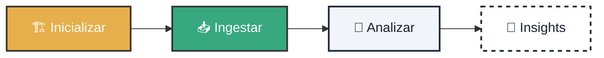

# 🚀 Despegue Inmediato: Tu Primer Análisis Cognitivo

!!! tip "Misión de Hoy"
    **Tiempo estimado:** 5 mins | **Requisito:** Python 3.10+

    Bienvenido al puente de mando. Transformarás datos brutos en inteligencia estructurada.

---

<div class="tactical-container tactical-container--compact">
  <h3 class="tactical-title">Flujo de Activación</h3>


</div>

## 1. 🏗️ Inicialización del Entorno

Preparamos el terreno. Este comando crea tu infraestructura soberana.

=== "Ejecutar Comando"
    ```bash
    python cogctl.py init
    ```

=== "🔎 ¿Qué sucede?"
    Se crean 3 carpetas clave:
    *   `data/input`: Tu buzón de entrada.
    *   `data/processing`: La cocina de datos.
    *   `outputs`: Donde se sirven los resultados.

<br><br>

## 2. 📥 Ingesta de Conocimiento

Alimenta al sistema. Mueve un archivo (PDF o TXT) a `data/input`.

=== "Paso 1: Copiar"
    *(Hazlo manualmente o usa este comando)*
    ```bash
    cp mi_documento.pdf data/input/
    ```

=== "Paso 2: Ingestar"
    ```bash
    python cogctl.py ingest mi_documento.pdf
    ```

!!! success "Soberanía Garantizada"
    Tus archivos **NUNCA** salen de este ordenador. Procesamiento 100% Local.

<br><br>

## 3. 🧠 Análisis Cognitivo

El momento de la verdad. Activa la IA para extraer inteligencia.

```bash
python cogctl.py analyze
```

<br><br>

## 4. 💎 Resultados

¡Hecho! 🏁 Abre el archivo resultante para ver la magia:

### 🔍 Desglose del Resultado

El archivo `analysis.json` es el "cerebro" extraído de tu documento. Aquí te explicamos qué significa cada sección:

??? check "Ver Ejemplo de Resultado Realista"
    ```json
    {
      "metadata": {
        "filename": "contrato_proveedor_v2.pdf",
        "processed_at": "2026-05-20T10:30:00Z",
        "sovereignty_score": 100 // (1)
      },
      "cognitive_profile": {
        "summary": "Acuerdo de servicios de desarrollo de software...",
        "entities": [ // (2)
          { "text": "Atlantyqa Labs", "label": "ORG", "relevance": 0.98 },
          { "text": "María González", "label": "PERSON", "role": "Signatory" }
        ],
        "legal_references": [ // (3)
          { "ref": "GDPR Art. 28", "description": "Encargado del tratamiento" }
        ],
        "risk_flags": [ // (4)
          {
            "level": "HIGH",
            "category": "Compliance",
            "text": "Penalización por retraso del 5% diario"
          }
        ]
      }
    }
    ```

    1.  **Sovereignty Score**: Indica qué porcentaje del procesamiento se realizó localmente. Un 100 significa privacidad absoluta.
    2.  **Entities**: Personas, organizaciones y fechas detectadas automáticamente.
    3.  **Legal References**: Leyes o normativas citadas (e.g., GDPR, ISO).
    4.  **Risk Flags**: Cláusulas o términos que podrían requerir revisión humana (e.g., penalizaciones altas).

---

### Siguiente Nivel

<div class="hero-cta hero-cta--start hero-cta--mt-3">
  <a href="../learning-path/" class="btn-primary">Explorar Ruta de Aprendizaje →</a>
</div>
