# 🏆 Talent Challenge Labs

!!! abstract "Training Ground"
    Prove your worth in real scenarios. These Labs aren't theoretical simulations; they're **operational missions** where your performance is measured with cryptographic evidence.

---

  <h3 class="tactical-title">Evaluation Ecosystem</h3>

```mermaid
graph TD
    User[👤 Talent] -->|Executes Lab| Agent[🤖 AI Agent]
    Agent -->|Validates Evidence| Score[💯 Score]
    Score -->|Unlocks| Badge[🏅 Verified Badge]

    style User fill:#e7ae4c,stroke:#333,stroke-width:2px,color:#fff
    style Agent fill:#e0e7ff,stroke:#333,stroke-width:2px,color:#182232
    style Score fill:#37a880,stroke:#333,stroke-width:2px,color:#fff
    style Badge fill:#f1f5f9,stroke:#182232,stroke-width:2px,color:#182232
```

## 1. 📂 Available Missions

Choose your difficulty level. Each completed mission forges your reputation in the community.

    

        <h3>🟢 Lab 01: Deep Dive</h3>
        
<strong>Objective:</strong> Configure the <em>Secure Pipeline</em>. Establish a baseline and run local analysis with active redaction.

        
<strong>Reward:</strong> <code>50 XP</code> + Badge 🛡️

        <a href="../lab-01-deep-dive/" class="btn-secondary btn-block">Start Mission</a>
    

    

        <h3>🔵 Lab 02: GitOps Steward</h3>
        
<strong>Objective:</strong> Sync results to the cloud without leaking a single sensitive byte. Master the secure GitOps flow.

        
<strong>Reward:</strong> <code>100 XP</code> + Badge ☁️

        <a href="../lab-02-gitops-steward/" class="btn-secondary btn-block">Start Mission</a>
    

    

        <h3>🟣 Lab 03: Bootstrap Dashboard</h3>
        
<strong>Objective:</strong> Create a visual command center with Streamlit. Visualize insights without touching code.

        
<strong>Reward:</strong> <code>75 XP</code> + Badge 📊

        <a href="../lab-03-bootstrap-dashboard/" class="btn-secondary btn-block">Start Mission</a>
    

---

## 2. 🤖 Your AI Copilot

You're not alone. A personal agent will accompany you during the challenge.

=== "🧭 Guide"
    Will explain the mission context and give you hints if you get stuck, without solving the problem for you.

=== "🛡️ Guardian"
    If you try to `git push` confidential data, the agent will block the action and explain the risk.

=== "⚖️ Judge"
    Will analyze your audit logs and `commit message` quality to calculate your final score.

---

## 3. 📜 Evaluation Rubric

Perfection isn't the goal, **consistency** is.

| Criterion | Weight | Description |
| :--- | :--- | :--- |
| **Correctness** | 40% | Does the code do what it should? |
| **Security** | 25% | Were redaction policies respected? |
| **Quality** | 20% | Code cleanliness, tests, and documentation. |
| **Collaboration** | 15% | Clarity in PR communication. |

> [!CAUTION]
> **Zero Tolerance for Fraud:** Any attempt to falsify audit logs will result in immediate and permanent disqualification.
