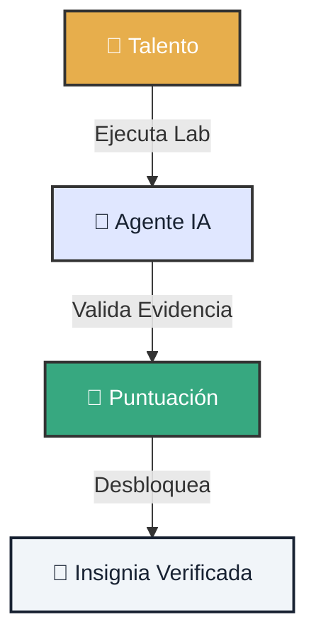

# 🏆 Labs de Desafío de Talento

!!! abstract "Campo de Entrenamiento"
    Demuestra tu valía en escenarios reales. Estos Labs no son simulaciones teóricas; son **misiones operativas** donde tu desempeño se mide con evidencia criptográfica.

---

  <h3 class="tactical-title">El Ecosistema de Evaluación</h3>

## 1. 📂 Misiones Disponibles

Elige tu nivel de dificultad. Cada misión completada forja tu reputación en la comunidad.

    

        <h3>🟢 Lab 01: Inmersión Profunda</h3>
        
<strong>Objetivo:</strong> Configurar el <em>Pipeline Seguro</em>. Establecer una línea base y ejecutar el análisis local con redacción activa.

        
<strong>Recompensa:</strong> <code>50 XP</code> + Insignia 🛡️

        <a href="../lab-01-deep-dive/" class="btn-secondary btn-block">Iniciar Misión</a>
    

    

        <h3>🔵 Lab 02: GitOps Steward</h3>
        
<strong>Objetivo:</strong> Sincronizar resultados a la nube sin filtrar ni un solo byte sensible. Dominar el flujo GitOps seguro.

        
<strong>Recompensa:</strong> <code>100 XP</code> + Insignia ☁️

        <a href="../lab-02-gitops-steward/" class="btn-secondary btn-block">Iniciar Misión</a>
    

    

        <h3>🟣 Lab 03: Bootstrap Dashboard</h3>
        
<strong>Objetivo:</strong> Crear un centro de comando visual con Streamlit. Visualizar insights sin tocar código.

        
<strong>Recompensa:</strong> <code>75 XP</code> + Insignia 📊

        <a href="../lab-03-bootstrap-dashboard/" class="btn-secondary btn-block">Iniciar Misión</a>
    

---

## 2. 🤖 Tu Copiloto IA

No estás solo. Un agente personal te acompañará durante el desafío.

=== "🧭 Guía"
    Te explicará el contexto de la misión y te dará pistas si te atascas, sin resolver el problema por ti.

=== "🛡️ Guardián"
    Si intentas hacer un `git push` de datos confidenciales, el agente bloqueará la acción y te explicará el riesgo.

=== "⚖️ Juez"
    Analizará tus logs de auditoría y la calidad de tus `commit messages` para calcular tu puntuación final.

---

## 3. 📜 Rúbrica de Evaluación

La perfección no es el objetivo, la **consistencia** sí.

| Criterio | Peso | Descripción |
| :--- | :--- | :--- |
| **Corrección** | 40% | ¿El código hace lo que debe hacer? |
| **Seguridad** | 25% | ¿Se respetaron las políticas de redacción? |
| **Calidad** | 20% | Limpieza del código, tests y documentación. |
| **Colaboración** | 15% | Claridad en la comunicación del PR. |

> [!CAUTION]
> **Tolerancia Cero al Fraude:** Cualquier intento de falsificar logs de auditoría resultará en la descalificación inmediata y permanente.
