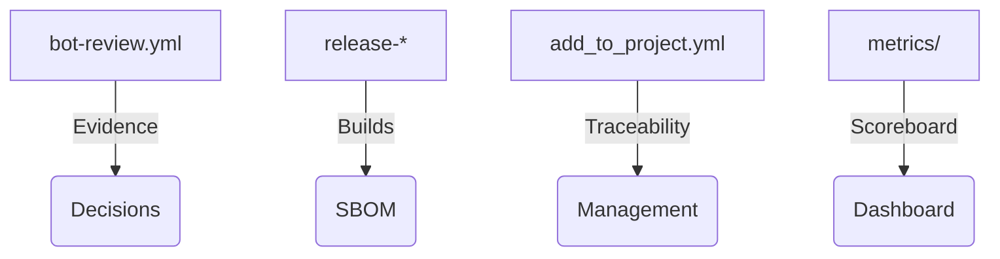

# Regulated Corporations · ATLANTYQA One-Pager

Sales Asset · Banking, Insurance, Utilities, Hospitals

> *Institutional elevator pitch (30s)*
> "Banks, insurers, utilities, and hospitals need to automate with AI without losing control or opening regulatory fronts. ATLANTYQA provides sovereign agents, compliance evidence pipelines, and squads that operate with built-in audit and legal knowledge."

---

## 1. Structural Problem

- Technological multipolarity and hyperscaler dependency
- Regulations (AI Act, NIS2, CRA, GDPR) without homogeneous material capacity
- Operational risk, loss of control, and insufficient talent

## 2. ATLANTYQA Proposal

Agentic Ops Pack: document and service agents running on-premise or in secure micro-CPDs, accompanied by compliance-as-code and real-time reporting. Fully audited with bot-review and versioned artifacts.

## 3. Key Deliverables

### 🤖 Configurable Agents
Document/operational agents with configurable guardrails and predefined profiles.

### 🏭 Compliance Evidence Factory
Automated pipelines + CI evidence outputs + metrics.

### 🎓 Reskilling Programs
Academy + XP ledger documenting talent and assigning badges.

## 4. Success Metrics

- Reduced cycle time for approvals and audits
- Reduction in sensitive data-related incidents
- XP/badges dashboards activated for squads and reviewers

## 5. Core Argument

"We reduce external dependency, turn compliance into a productive asset, and deliver full control over data and automations."

