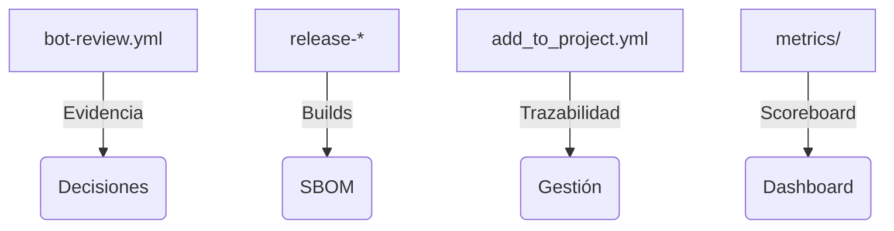

<!--
Plantilla reutilizable para convertir cada uno de los one-pagers en assets listos para CRM/documentos de venta.
Rellena los placeholders ({{ }}) con los datos del cliente/actor concreto; mantén el texto institucional intacto.
-->

# Grandes corporaciones reguladas · One-Pager ATLANTYQA · One-Pager ATLANTYQA

> *Elevator Pitch institucional (30s)*
> “Los bancos, aseguradoras, utilities y hospitales necesitan automatizar con IA sin perder control ni abrir frentes regulatorios. ATLANTYQA ofrece agentes soberanos, compliance evidence pipelines y squads que operan con auditoría y conocimiento legal incorporado.”

## 1. Problema estructural
- Multipolaridad tecnológica y dependencia de hyperscalers
- Regulaciones (AI Act, NIS2, CRA, GDPR) sin capacidad material homogénea
- Riesgo operativo, pérdida de control y talento insuficiente

## 2. Propuesta ATLANTYQA
Agentic Ops Pack: agentes documentales y de atención que corren on-premise o en microCPD seguro, acompañados de compliance-as-code y reporting en tiempo real. Todo auditado con bot-review y artefactos versionados.

## 3. Entregables (cliente específico)
1. Agentes documentales/operativos con guardarraíles configurables (perfiles predefinidos).
2. Compliance Evidence Factory (pipelines automáticos + outputs/ci-evidence + métricas).
3. Programas de reskilling (Academy + XP ledger) que documentan talento y asignan badges.

## 4. Métricas / Indicadores de éxito
- Tiempo de ciclo reducido para aprobaciones y auditorías (medido en outputs/bot-evidence).
- Reducción de incidentes relacionados con datos sensibles.
- Dashboards de XP/badges activados para squads y reviewers (metrics/xp-rules).

## 5. Argumentario principal
> “Reducimos dependencia externa, transformamos el cumplimiento en activo y damos control total sobre datos y automatizaciones.”

## 6. Próximo paso recomendado
- Coordinación con risk committees y squads legales (squad/Academy/partner)
- Demo/piloto específico (e.g., prueba piloto Agentic Ops Pack en un dominio regulado)
- Documentación + pricing (link a `docs/sales/one-pagers.md#3-corporates`)
