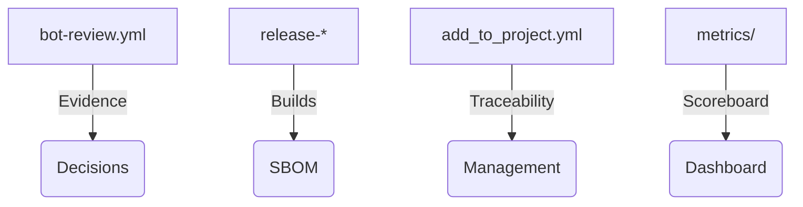

# European Commission · ATLANTYQA One-Pager

Sales Asset · EU Institutions

> *Institutional elevator pitch (30s)*
> "Europe has regulation, but not always the material capacity to execute it. ATLANTYQA builds sovereign cognitive infrastructure: local AI, audited automation, and compliance-as-code. We reduce external dependency, lower regulatory risk, and turn compliance into a productive asset."

---

## 1. Structural Problem

- Technological multipolarity and hyperscaler dependency
- Regulations (AI Act, NIS2, CRA, GDPR) without homogeneous material capacity
- Operational risk, loss of control, and insufficient talent

## 2. ATLANTYQA Proposal

Sovereign Cognitive Stack: local AI, autonomous agents, and continuous evidence deployed in air-gapped environments and micro-CPDs. The stack is coordinated with TaaS squads and supported by workflows that generate SBOMs, logs, and impact metrics.

## 3. Key Deliverables

### 📦 AI Sovereignty-in-a-Box
Micro-CPD + local AI + evidence portal ready to replicate across DGs and European agencies.

### 🏭 Compliance Evidence Factory
Reproducible pipelines, CI evidence outputs, and metric dashboards + Gitea evidence repo.

### 🤖 Governed Agents + Kill-switch
Document/operational agents with auditable logs and mitigation protocols.

## 4. Success Metrics

- Percentage of decisions supported by local agents vs external cloud
- Evidence stored in `outputs/ci-evidence` and `outputs/bot-evidence`
- Badge + XP scoreboard reproduced in metrics dashboards

## 5. Core Argument

"We reduce external dependency, turn compliance into a productive asset, and deliver full control over data and automations."

