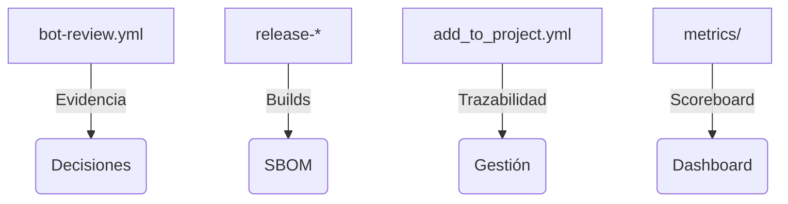

<!--
Plantilla reutilizable para convertir cada uno de los one-pagers en assets listos para CRM/documentos de venta.
Rellena los placeholders ({{ }}) con los datos del cliente/actor concreto; mantén el texto institucional intacto.
-->

# Comisión Europea · One-Pager ATLANTYQA · One-Pager ATLANTYQA

> *Elevator Pitch institucional (30s)*
> “Europa tiene regulación, pero no siempre capacidad material para ejecutarla. Las empresas y administraciones quieren IA, automatización y eficiencia, pero sin perder el control de sus datos ni asumir riesgos regulatorios inasumibles. ATLANTYQA construye infraestructura cognitiva soberana: IA local, automatización auditada y cumplimiento como código. Reducimos dependencia externa, bajamos riesgo regulatorio y convertimos el cumplimiento en un activo productivo.”

## 1. Problema estructural
- Multipolaridad tecnológica y dependencia de hyperscalers
- Regulaciones (AI Act, NIS2, CRA, GDPR) sin capacidad material homogénea
- Riesgo operativo, pérdida de control y talento insuficiente

## 2. Propuesta ATLANTYQA
Sovereign Cognitive Stack: IA local, agentes autónomos y evidencias continuas desplegadas en entornos air-gapped y microCPDs. La pila se coordina con squads TaaS y se apoya en workflows que generan SBOMs, bitácoras y métricas de impacto.

## 3. Entregables (cliente específico)
1. Kit 'AI Sovereignty-in-a-Box': microCPD + IA local + portal de evidencias listo para replicar en DGs y agencias europeas.
2. Compliance Evidence Factory: pipelines reproducibles, outputs/ci-evidence y dashboards de métricas + Gitea evidence repo.
3. Governed agents + kill-switch: agentes documentales/operativos con logs auditables y protocolos de mitigación respaldados por bot-review y metrics.

## 4. Métricas / Indicadores de éxito
- Porcentaje de decisiones apoyadas en agentes locales vs cloud externo.
- Evidencias almacenadas en outputs/ci-evidence y outputs/bot-evidence.
- Badge + XP scoreboard reproducido en docs/portal/metrics.md y metrics/users/.

## 5. Argumentario principal
> “Reducimos dependencia externa, transformamos el cumplimiento en activo y damos control total sobre datos y automatizaciones.”

## 6. Próximo paso recomendado
- Coordinación con squads ATLANTYQA + DGs (squad/Academy/partner)
- Demo/piloto específico (e.g., piloto AI Sovereignty-in-a-Box)
- Documentación + pricing (link a `docs/sales/one-pagers.md#1-union-europea`)
