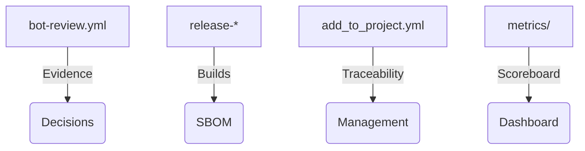

# Technology Integrators / Partners · ATLANTYQA One-Pager

Sales Asset · Technology Partners

> *Institutional elevator pitch (30s)*
> "Your clients demand sovereign automation and compliance. ATLANTYQA gives you a repeatable framework — pipelines, evidence stack, squads — that you can resell as a managed service."

---

## 1. Structural Problem

- Technological multipolarity and hyperscaler dependency
- Regulations (AI Act, NIS2, CRA, GDPR) without homogeneous material capacity
- Operational risk, loss of control, and insufficient talent

## 2. ATLANTYQA Proposal

Compliance Evidence Pack + Sovereign Agents replicable across partners, with workflows that generate reproducible artifacts and metric dashboards.

## 3. Key Deliverables

### 📋 Compliance-as-Code Framework
Ready to integrate into proposals: JSONL, badges, evidence.

### 🤖 Sovereign Agent Kit
Agents + guardrails (bot-review scripts).

### 🎓 Training & Operations
ATLANTYQA Academy squads + TaaS (talent + XP ledger).

## 4. Success Metrics

- Number of deployments replicated per partner
- Evidence generated per end client
- Recurring revenue from maintenance/compliance + squads

## 5. Core Argument

"We reduce external dependency, turn compliance into a productive asset, and deliver full control over data and automations."

