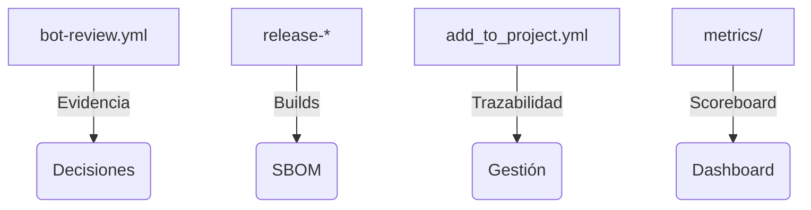

<!--
Plantilla reutilizable para convertir cada uno de los one-pagers en assets listos para CRM/documentos de venta.
Rellena los placeholders ({{ }}) con los datos del cliente/actor concreto; mantén el texto institucional intacto.
-->

# Integradores tecnológicos / partners · One-Pager ATLANTYQA · One-Pager ATLANTYQA

> *Elevator Pitch institucional (30s)*
> “Tus clientes exigen automatización soberana y compliance. ATLANTYQA te da un framework repetible (pipelines, evidence stack, squads) que puedes revender como servicio gestionado.”

## 1. Problema estructural
- Multipolaridad tecnológica y dependencia de hyperscalers
- Regulaciones (AI Act, NIS2, CRA, GDPR) sin capacidad material homogénea
- Riesgo operativo, pérdida de control y talento insuficiente

## 2. Propuesta ATLANTYQA
Compliance Evidence Pack + Sovereign Agents replicable en partners, con workflows que generan artefactos reproducibles (release-*, add_to_project) y dashboards de métricas (docs/portal/metrics.md).

## 3. Entregables (cliente específico)
1. Marco 'Compliance-as-Code' listo para integrarse en propuestas (JSONL, badges, evidencias).
2. Kit de agentes soberanos + guardarraíles (scripts bot-review).
3. Formación/operación con squads ATLANTYQA Academy + TaaS (talento + XP ledger).

## 4. Métricas / Indicadores de éxito
- Número de deployments replicados por partner.
- Evidencia generada por cliente final (outputs/ci-evidence, dashboards).
- Revenue recurrente por mantenimiento/compliance + squads.

## 5. Argumentario principal
> “Reducimos dependencia externa, transformamos el cumplimiento en activo y damos control total sobre datos y automatizaciones.”

## 6. Próximo paso recomendado
- Coordinación con equipos comerciales + technical partners (squad/Academy/partner)
- Demo/piloto específico (e.g., taller conjunto y cliente piloto)
- Documentación + pricing (link a `docs/sales/one-pagers.md#4-integradores`)
