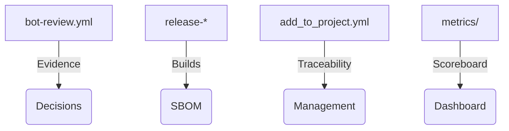

# Municipalities / Local Administrations · ATLANTYQA One-Pager

Sales Asset · Local Government

> *Institutional elevator pitch (30s)*
> "Municipalities need AI and automation with sovereignty, security, and local employment. ATLANTYQA deploys micro-CPDs, edge AI, and operational talent to deliver citizen services with full control."

---

## 1. Structural Problem

- Technological multipolarity and hyperscaler dependency
- Regulations (AI Act, NIS2, CRA, GDPR) without homogeneous material capacity
- Operational risk, loss of control, and insufficient talent

## 2. ATLANTYQA Proposal

Municipal Sovereignty Starter + Edge BlueTech: micro-CPD + sensors + local AI + portal backed by replicable workflows and dashboards.

## 3. Key Deliverables

### 🏛️ Municipal Micro-CPD
Blueprint + citizen portal + Edge BlueTech.

### 🎓 Academy Squads
ATLANTYQA Academy / TaaS program to operate nodes.

### 📊 Governance Dashboard
Dashboards, evidence, compliance + replicable deployment manual.

## 4. Success Metrics

- Deployed nodes (micro-CPDs + edge AI)
- Energy savings and service improvements
- New local technology jobs and documented reskilling

## 5. Core Argument

"We reduce external dependency, turn compliance into a productive asset, and deliver full control over data and automations."

