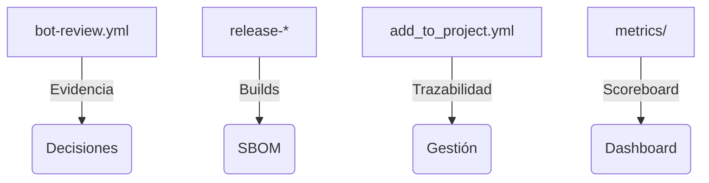

<!--
Plantilla reutilizable para convertir cada uno de los one-pagers en assets listos para CRM/documentos de venta.
Rellena los placeholders ({{ }}) con los datos del cliente/actor concreto; mantén el texto institucional intacto.
-->

# Municipios / administraciones locales · One-Pager ATLANTYQA · One-Pager ATLANTYQA

> *Elevator Pitch institucional (30s)*
> “Los municipios necesitan IA y automatización, pero con soberanía, seguridad y empleo local. ATLANTYQA despliega microCPDs, edge IA y talento operativo para resolver servicios ciudadanos con control total.”

## 1. Problema estructural
- Multipolaridad tecnológica y dependencia de hyperscalers
- Regulaciones (AI Act, NIS2, CRA, GDPR) sin capacidad material homogénea
- Riesgo operativo, pérdida de control y talento insuficiente

## 2. Propuesta ATLANTYQA
Municipal Sovereignty Starter + Edge BlueTech (microCPD + sensórica + IA local + portal) apoyado en dashboard/app.py, vectorstore y workflows replicables.

## 3. Entregables (cliente específico)
1. Blueprint de microCPD municipal + portal ciudadano + Edge BlueTech.
2. Programa de squads ATLANTYQA Academy / TaaS para operar nodos.
3. Panel de gobierno (dashboards, evidencia, compliance) y manual de deployment replicable.

## 4. Métricas / Indicadores de éxito
- Nodos desplegados (microCPDs + edge IA).
- Ahorros energéticos y mejora de servicios.
- Nuevos empleos tecnológicos locales y reskilling documentado en metrics/users.

## 5. Argumentario principal
> “Reducimos dependencia externa, transformamos el cumplimiento en activo y damos control total sobre datos y automatizaciones.”

## 6. Próximo paso recomendado
- Coordinación con equipos de smart city + procurement (squad/Academy/partner)
- Demo/piloto específico (e.g., demo con microCPD y portal)
- Documentación + pricing (link a `docs/sales/one-pagers.md#5-municipios`)
