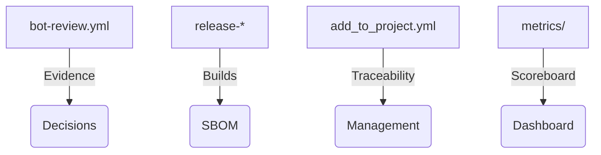

# Spanish State / Autonomous Communities · ATLANTYQA One-Pager

Sales Asset · State & Regional Government

> *Institutional elevator pitch (30s)*
> "The State and Autonomous Communities need to digitize without losing data sovereignty or financing external infrastructure. ATLANTYQA deploys local sovereign nodes, audited automation, and talent squads that execute public policies with full traceability and control."

---

## 1. Structural Problem

- Technological multipolarity and hyperscaler dependency
- Regulations (AI Act, NIS2, CRA, GDPR) without homogeneous material capacity
- Operational risk, loss of control, and insufficient talent

## 2. ATLANTYQA Proposal

Municipal Sovereignty Starter: micro-CPD + local AI + citizen portal + replicable evidence stack with run-local-workflow scripts, docker-compose, and operations playbooks.

## 3. Key Deliverables

### 📦 Micro-CPD Municipal Kit
Guided deployment with docs + scripts.

### 🎓 Academy Squads
ATLANTYQA Academy/TaaS training talent and operating local nodes.

### 📊 Sovereignty Dashboard
Dashboards with metrics, user updates, and auditable impact evidence.

## 4. Success Metrics

- Number of nodes deployed and replicated across provinces/regions
- Evidence registered in bot-evidence and user metrics
- Improved service times, cost reduction, and local tech job creation

## 5. Core Argument

"We reduce external dependency, turn compliance into a productive asset, and deliver full control over data and automations."

