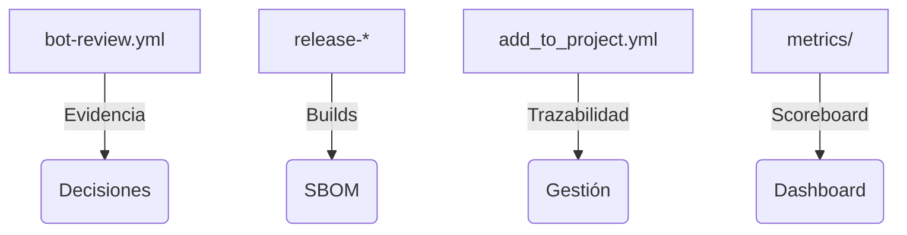

<!--
Plantilla reutilizable para convertir cada uno de los one-pagers en assets listos para CRM/documentos de venta.
Rellena los placeholders ({{ }}) con los datos del cliente/actor concreto; mantén el texto institucional intacto.
-->

# Estado español / Comunidades Autónomas · One-Pager ATLANTYQA · One-Pager ATLANTYQA

> *Elevator Pitch institucional (30s)*
> “El Estado y las CCAA necesitan digitalizar sin perder la soberanía de datos ni financiar infraestructuras externas. ATLANTYQA despliega nodos soberanos locales, automatización auditada y squads de talento que ejecutan políticas públicas con trazabilidad y control total.”

## 1. Problema estructural
- Multipolaridad tecnológica y dependencia de hyperscalers
- Regulaciones (AI Act, NIS2, CRA, GDPR) sin capacidad material homogénea
- Riesgo operativo, pérdida de control y talento insuficiente

## 2. Propuesta ATLANTYQA
Municipal Sovereignty Starter: microCPD + IA local + portal ciudadano + evidence stack replicable con run-local-workflow.sh, docker-compose y playbooks de docs/ops/local-runner.md.

## 3. Entregables (cliente específico)
1. Kit 'Micro-CPD municipal' con despliegue guiado (docs + scripts).
2. Programa de squads ATLANTYQA Academy/TaaS que forma talento y opera nodos locales.
3. Panel de soberanía (dashboards en docs/portal/metrics.md, actualizaciones metrics/users) con evidencia de impacto para contralores.

## 4. Métricas / Indicadores de éxito
- Número de nodos desplegados y replicados en provincias/regiones.
- Evidencias registradas en outputs/bot-evidence y metrics/users.
- Mejora de tiempos de servicio, reducción de coste y creación de empleo tecnológico local.

## 5. Argumentario principal
> “Reducimos dependencia externa, transformamos el cumplimiento en activo y damos control total sobre datos y automatizaciones.”

## 6. Próximo paso recomendado
- Coordinación con área de innovación + squads ATLANTYQA Academy (squad/Academy/partner)
- Demo/piloto específico (e.g., piloto microCPD + portal ciudadano)
- Documentación + pricing (link a `docs/sales/one-pagers.md#2-estado-espanol`)
