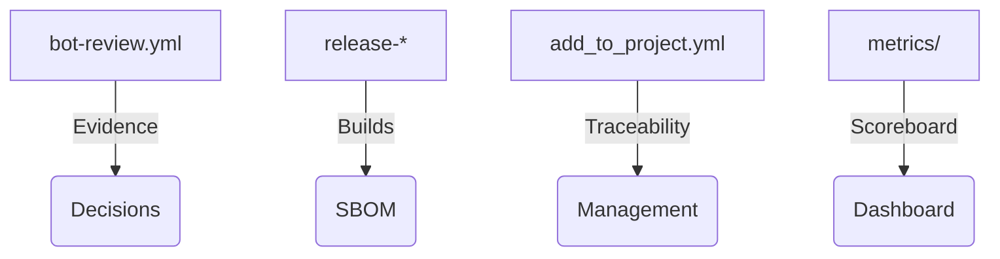

# Regulated Corporations · ATLANTYQA One-Pager

Sales Asset · Regulated Industries

> *Institutional elevator pitch (30s)*
> "Banks, insurers, utilities, and hospitals need to automate with AI without losing control or opening regulatory fronts. ATLANTYQA provides sovereign agents, compliance evidence pipelines, and squads that operate with built-in audit and legal knowledge."

---

## 1. Structural Problem

- Ungoverned automations increase reputational and legal risk
- Regulatory pressure (AI Act, NIS2, GDPR) demands traceability and continuous evidence
- Technology alone isn't enough — clear policies and auditable logging are required

## 2. ATLANTYQA Proposal

Agentic Ops Pack: document and service agents running on-premise or in secure micro-CPDs, with compliance-as-code and real-time reporting.

## 3. Deliverables

### 🤖 Configurable Agents
Document/operational agents with guardrails and predefined profiles.

### 🏭 Compliance Evidence Factory
Automated pipelines + CI evidence + metrics tracking.

### 🎓 Reskilling Programs
Academy + XP ledger documenting talent with badges.

## 4. Success Metrics

- Reduced cycle time for approvals and audits
- Reduction in sensitive data incidents
- XP/badges dashboards for squads and reviewers

## 5. Core Argument

"We automate without giving up control or compliance: every agent call is audited, every flow is versioned, and every decision can be explained to a regulator."

## 6. Recommended Next Step

- Pilot "Agentic Ops Pack" in a regulated domain (legal, financial)
- Validation with the agent governance framework (detailed documentation shared through private channels)
- Modular pricing (license + operations + squads) with risk/reputation offices

