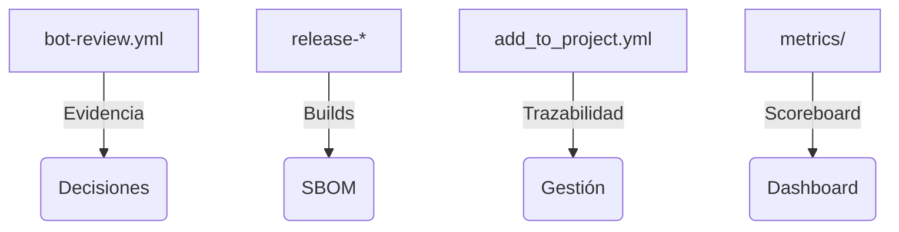

# Grandes corporaciones reguladas · One-Pager ATLANTYQA

> *Elevator Pitch institucional (30s)*
> “Los bancos, aseguradoras, utilities y hospitales necesitan automatizar con IA sin perder control ni abrir frentes regulatorios. ATLANTYQA ofrece agentes soberanos, compliance evidence pipelines y squads que operan con auditoría y conocimiento legal incorporado.”

## 1. Problema estructural
- Automatizaciones sin gobernanza aumentan riesgo reputacional y legal.
- Presión regulatoria (AI Act, NIS2, GDPR) exige trazabilidad y evidencia contínua.
- No basta con la tecnología; se requiere ejecución con políticas claras y logging auditable.

## 2. Propuesta ATLANTYQA
Agentic Ops Pack: agentes documentales y de atención que corren on-premise o en microCPD seguro, acompañados de compliance-as-code y reporting real-time.

## 3. Entregables
1. Agentes documentales/operativos con guardarraíles configurables (perfiles predefinidos).
2. Compliance Evidence Factory (pipelines automáticos + `outputs/ci-evidence` + `metrics` tracking).
3. Programas de reskilling (Academy + XP ledger) que documentan talento y asignan badges.

## 4. Métricas de éxito
- Tiempo de ciclo reducido para aprobaciones y auditorías (medido en `outputs/bot-evidence`).
- Reducción de incidentes relacionados con datos sensibles.
- Dashboards de XP/badges activados para squads y reviewers (ver `metrics/xp-rules`).

## 5. Argumentario principal
> “Automatizamos sin renunciar a control ni compliance: cada agent call está auditada, cada flujo versionado y cada decisión puede explicarse ante un regulador.”

## 6. Próximo paso recomendado
- Prueba piloto de “Agentic Ops Pack” en un dominio regulado (legal, exp. financiero).
- Validación con marco de gobernanza para agentes (documentación detallada disponible en canal privado).
- Pricing modular (licencia + operación + squads) con oficinas de riesgo/reputación.
