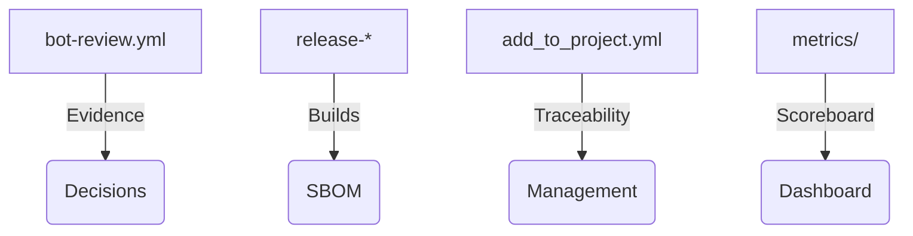

<!--
Reusable template to convert each one-pager into CRM/sales-ready assets.
Fill in the placeholders ({{ }}) with the specific client/actor data; keep the institutional text intact.
-->

# {{ actor_name }} · ATLANTYQA One-Pager

Sales Asset · {{ segment }}

> *Institutional elevator pitch (30s)*
> "{{ elevator_pitch }}"

---

## 1. Structural Problem

- Technological multipolarity and hyperscaler dependency
- Regulations (AI Act, NIS2, CRA, GDPR) without homogeneous material capacity
- Operational risk, loss of control, and insufficient talent

## 2. ATLANTYQA Proposal

{{ sovereign_stack_description }}

## 3. Deliverables (client-specific)

### Deliverable 1
{{ deliverable_1 }}

### Deliverable 2
{{ deliverable_2 }}

### Deliverable 3
{{ deliverable_3 }}

## 4. Metrics / Success Indicators

- {{ metric_1 }}
- {{ metric_2 }}
- {{ metric_3 }}

## 5. Core Argument

"We reduce external dependency, turn compliance into a productive asset, and deliver full control over data and automations."

## 6. Recommended Next Step

- Coordination with {{ team_onboarding }} (squad/Academy/partner)
- Specific demo/pilot (e.g., {{ pilot_idea }})
- Documentation + pricing (link to `docs/sales/one-pagers.md#{{ actor_anchor }}`)

