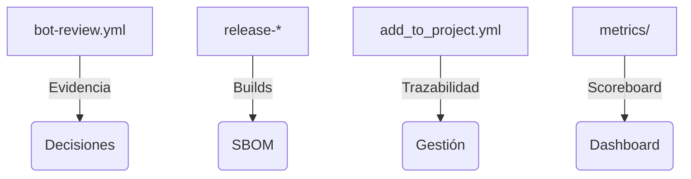

<!--
Plantilla reutilizable para convertir cada uno de los one-pagers en assets listos para CRM/documentos de venta.
Rellena los placeholders ({{ }}) con los datos del cliente/actor concreto; mantén el texto institucional intacto.
-->

# {{ actor_name }} · One-Pager ATLANTYQA

Asset Comercial · {{ segmento }}

> *Elevator Pitch institucional (30s)*
> "{{ elevator_pitch }}"

---

## 1. Problema Estructural

- Multipolaridad tecnológica y dependencia de hyperscalers
- Regulaciones (AI Act, NIS2, CRA, GDPR) sin capacidad material homogénea
- Riesgo operativo, pérdida de control y talento insuficiente

## 2. Propuesta ATLANTYQA

{{ sovereign_stack_description }}

## 3. Entregables (cliente específico)

### Entregable 1
{{ deliverable_1 }}

### Entregable 2
{{ deliverable_2 }}

### Entregable 3
{{ deliverable_3 }}

## 4. Métricas / Indicadores de Éxito

- {{ metric_1 }}
- {{ metric_2 }}
- {{ metric_3 }}

## 5. Argumentario Principal

"Reducimos dependencia externa, transformamos el cumplimiento en activo y damos control total sobre datos y automatizaciones."

## 6. Próximo Paso Recomendado

- Coordinación con {{ team_onboarding }} (squad/Academy/partner)
- Demo/piloto específico (e.g., {{ pilot_idea }})
- Documentación + pricing (link a `docs/sales/one-pagers.md#{{ actor_anchor }}`)

