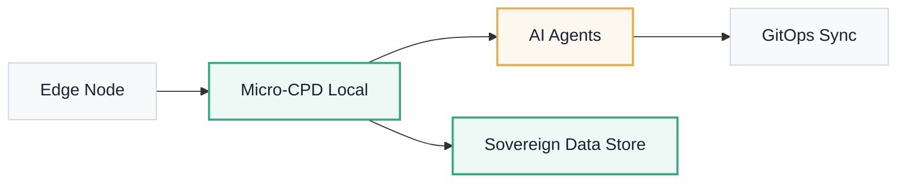

# Deployment Models

Architecture · Data Sovereignty

ATLANTYQA adapts to the data residency requirements and isolation level of each organization.

---

## Deployment Options

### 🏠 Local-first / On-prem
Micro-CPDs and edge nodes that host all agents and keep sensitive data local. Full control without external connectivity.

### ☁️ Hybrid
Less critical workloads in certified cloud while preserving data residency for sensitive data. Best of both worlds.

### 🔒 Air-gapped
Fully isolated enclaves for high-risk decisions. No external egress; reproducible offline builds.

### Reference Topology

!!! info "Compute Strategy"
    Our compute strategy details which workloads stay local and how secure connectivity is managed. See the public [compute strategy](../compute-strategy.en.md) guide.

Need a deployment model tailored to your organization?

<a href="../trust/overview/" class="btn-primary btn-primary--inline">View Full Trust Pack →</a>

