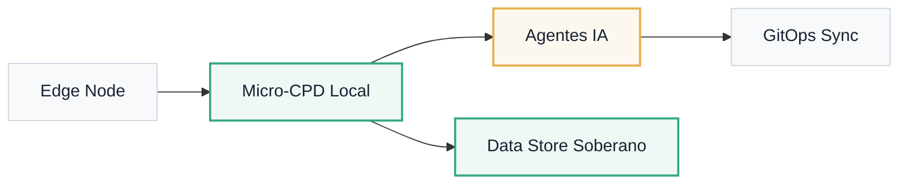

# Modelos de Despliegue

Arquitectura · Soberanía de Datos

ATLANTYQA se adapta a las necesidades de residencia de datos y nivel de aislamiento de cada organización.

---

## Opciones de Despliegue

### 🏠 Local-first / On-prem
Micro-CPDs y nodos edge que ejecutan todos los agentes y guardan los datos sensibles. Control total sin conectividad externa.

### ☁️ Híbrido
Tareas menos críticas en cloud certificada, manteniendo data residency para datos sensibles. Lo mejor de ambos mundos.

### 🔒 Air-gap
Enclaves completamente aislados para decisiones de alto riesgo. Sin egress externo; builds reproducibles offline.

### Topología de Referencia

!!! info "Estrategia de Cómputo"
    Nuestra estrategia de cómputo detalla qué cargas se mantienen locales y cómo se gestiona la conectividad segura. Consulta la guía pública de [compute strategy](../compute-strategy.md).

¿Necesitas un modelo de despliegue adaptado a tu organización?

<a href="../trust/overview/" class="btn-primary btn-primary--inline">Ver Trust Pack Completo →</a>

