# Local User Interface

Experience · Secure Local-First

The user vision for the **Atlantyqa Cognitive Suite** focuses on a local-first, secure experience oriented toward operational efficiency through GitOps.

---

## System Roles

| Role | Description | Key Capabilities |
|:---|:---|:---|
| **Local Administrator** | Infrastructure and policy manager | Configuration, user management, auditing |
| **Knowledge Analyst** | Primary analysis user | Ingestion, analysis execution, cognitive tagging |
| **GitOps Operator** | Persistence responsible | Repo control, PRs, policy validation |
| **Executive Viewer** | Reporting and consultation user | Critical dashboards and report exports |

## General Usage Flow

```mermaid
graph LR
    Auth[🔐 Authentication] --> Dash[📊 Dashboard]
    Dash --> Ingest[📥 Ingestion]
    Ingest --> Analyze[🧠 Analysis]
    Analyze --> GitOps[🔄 GitOps]

    style Auth fill:#f8f9fa,stroke:#cbd5e0,stroke-width:1px,color:#182232
    style Dash fill:#eef9f5,stroke:#37a880,stroke-width:2px,color:#182232
    style Ingest fill:#fdf8ef,stroke:#e7ae4c,stroke-width:2px,color:#182232
    style Analyze fill:#eef9f5,stroke:#37a880,stroke-width:2px,color:#182232
    style GitOps fill:#f8f9fa,stroke:#cbd5e0,stroke-width:1px,color:#182232
```

## Non-Negotiable UX Requirements

### 🏠 Offline Mode
All processing occurs within your infrastructure. "Your data never leaves your enclave."

### 🔄 GitOps Feedback
Synchronization status always visible for critical actions. Full operational transparency.

### 📋 Version Control
Every analysis and report has full traceability in Git. Immutable history.

