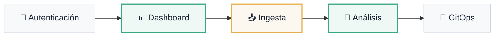

# Interfaz de Usuario Local

Experiencia · Local-First Segura

La visión de usuario de la **Atlantyqa Cognitive Suite** se centra en una experiencia local-first, segura y orientada a la eficiencia operativa a través de GitOps.

---

## Roles del Sistema

| Rol | Descripción | Capacidades Clave |
|:---|:---|:---|
| **Administrador Local** | Gestor de infraestructura y políticas | Configuración, gestión de usuarios, auditoría |
| **Analista de Conocimiento** | Usuario principal de análisis | Ingesta, ejecución de análisis, etiquetado cognitivo |
| **Operador GitOps** | Responsable de persistencia | Control de repos, PRs, validación de políticas |
| **Visor Ejecutivo** | Usuario de consulta y reportes | Dashboards críticos y exportación de informes |

## Flujo de Uso General

## Requisitos UX No Negociables

### 🏠 Modo Offline
Todo el procesamiento ocurre dentro de tu infraestructura. "Tu dato no sale de tu enclave".

### 🔄 Feedback GitOps
Estado de sincronización siempre visible para acciones críticas. Transparencia operativa total.

### 📋 Control de Versiones
Cada análisis e informe cuenta con trazabilidad total en Git. Historial inmutable.

